# Java 线程


## 进程与线程

进程  是**系统资源分配**的单位

线程  是**CPU调度和执行**的单位。 一个进程至少包含一个线程！

**并行** ： 指在同一时刻，有多条指令在多个处理器上同时执行。所以无论从微观还是从宏观来看，二者都是一起执行的。
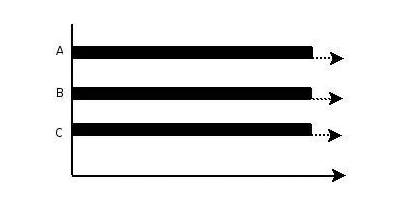

**并发** ：指在同一时刻只能有一条指令执行，但多个进程指令被快速的轮换执行，使得在宏观上具有多个进程同时执行的效果，但在微观上并不是同时执行的，只是把时间分成若干段，使多个进程快速交替的执行。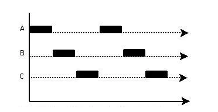

**一些概念**：

* 线程就是独立的执行路径
* 在程序运行时，即使没有自己创建线程，后台也有多个线程。如主线程，gc线程。
* main 称之为主线程，是系统的路口，用于执行整个程序
* 在一个进程中，如果开辟了多个线程，线程的运行由调度器（CPU）安排调度，调度器是与操作系统紧密相关的，先后顺序是不能人为干预的
* 对于同一份资源操作时，会存在资源抢夺的问题，需要加入并发控制。
* 线程会带来额外的开销，如CPU的调度时间，并发控制开销。
* 每个线程在自己的工作内存交互时，内存控制不当会造成数据不一致。


## Java 实现 线程的方法

1. 继承 Thread 类
2. 实现 Runnable 接口
3. 实现 Callable 接口


### 继承 thread  

	1. 自定义线程类继承Thread
 	2. 重写 **run()** 方法，编写线程执行体
 	3. 创建线程对象，调用 **start()** 方法   

``` java
 class MyThread extends Thread {       
   public void run() {
      // compute primes larger than minPrime
      . . .
   }
}

public void static main(String[] ages){
    MyThread t = new MyThread();
    t.start();	
}


```


### 实现Runnable

	1. 定义 自定义的Runable 类实现Runable接口
 	2. 重写 **run()** 方法，编写线程执行体
 	3. 创建线程对象，调用 **start()** 方法    但是这里创建对象时需要把我们实现好的Runable类放入构造函数中

``` java
class MyRunnable implements Runnable {     
    public void run() {
        // compute primes larger than minPrime
        . . .
    }
}

public void static main(String[] ages){
    MyRunnable r = new MyRunnable(143);
    new Thread(r).start();	
}

```

推荐使用 实现Runnable ，因为继承Thread 会导致Java的单继承的局限性。而使用实现Runnable可以避免单继承的局限性，而且方便同一个对象被多个线程调用

### 实现Callable接口

1. 实现Callable接口，需要返回值类型.  Callable<T>   Callable是一个泛型接口
2. 重写 call 方法，需要抛出异常
3. 创建目标对象。  Callable<T> t = new CallableImpl<>();
4. 创建执行服务。ExecutorService ser = Executors.newFixedThreadPool(1);
5. 提交执行。 Future<T> res = ser.submit( t ) ;
6. 获取结果。  T t = res.get();
7. 关闭服务。 ser.shutdownNow();

Callable是不能直接被 thread 运行的！！ thread只能运行Runnable中的run方法。所以这个时候就需要一个中间适配器！！这就是FutrueTask。  FutrueTask 中实现了run 方法。


Callable 和  Runnable 的区别

1.Callable能接受一个泛型，然后在call方法中返回一个这个类型的值。而Runnable的run方法没有返回值
2.Callable的call方法可以抛出异常，而Runnable的run方法不会抛出异常。


## 线程状态

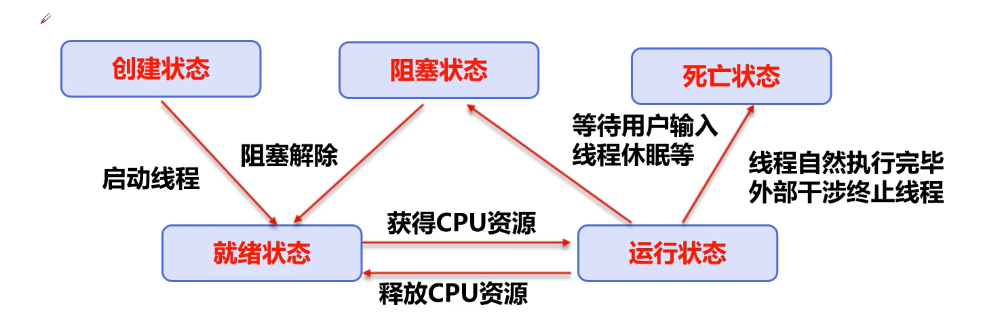

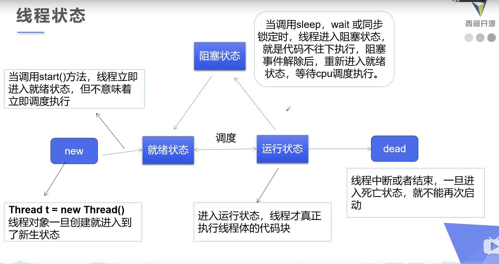


### 线程状态

Thread.State    线程状态。

- **NEW**
  线程尚未启动处于此状态    (new)
- **RUNNABLE**
  在java虚拟机执行的线程处于此状态。  (start)
- **BLOCKED**
  被阻塞等待监视器锁定的线程处于此状态
- **WAITING**
  正在等待另一个线程执行特定动作的线程处于此状态
- **TIMED_WAITING**
  正在等待另一个线程执行动作达到指定等待时间的线程处于这种状态。 
- **TERMINATED**
  已退出的线程处于这种状态。 

确定一个线程的当前状态，可以调用getState() 方法

https://www.cnblogs.com/waterystone/p/4920007.html

**一个死亡的线程 是不可以 重新 启动！！**

### 线程优先级           setPriority()  getPriority()

默认情况下，一个线程继承他的父类的优先级。可以将优先级设置为 MIN_PRIORITY(1) 与 MAX_PRIORITY(10)之间的任何值，如果小于最小值或者大于最大值那么就会抛出异常！！。NORM_PRIORITY(5)默认情况下线程的优先级为5。

要先设置优先级再启动，这样我们设置的优先级才有作用。  

**优先级低只是意味着获得调度的概率低，并不是优先级低就不会被调用，这都是要看CPU的调度。**

### 守护线程       setDeamon()

线程 分为 用户现场和守护线程。   虚拟机必须确保用户线程执行完毕，虚拟机不用等待守护线程执行完毕。例如后台记录日志，监控内存，垃圾回收等等。所以当只剩下守护线程时，虚拟机就会退出，就没必要继续运行程序了。

守护线程的 唯一作用就是 为其他线程服务。
守护线程应该永远不要去访问固有资源，例如文件，数据库。因为它会再任何时候会甚至在操作的中间发生中断。

**t.setDeamon(true); 标识该线程为守护线程，这一方法必须在线程启动之前调用。**

### 线程停止

如果要停止一个线程  不推荐使用JDK 提供的 stop() 、 destroy() 方法【已废弃】。
推荐线程自己停止下来， 建议自己使用一个标志位，终止变量。例如当flag=false，则终止线程运行。

``` java
public class TestThread implements Runnable{
    // 线程中提供一个标识
    private boolean flag = true;
    
    public void run(){
        //在线程体中 使用 该标识
        while(flag){
            ...
        }
    }
    // 对外提供方法改变标识
    public void stop(boolean flag){
        this.flag = flag;
    }
}
```

### 线程休眠   sleep

* sleep 指定当前线程阻塞的毫秒数 
* sleep 存在异常 InterruptedException
* sleep 时间达到后线程进入就绪状态
* sleep 可以模拟网络延时，倒计时等等
* **sleep 不会释放锁**！！！

### 线程礼让   yield 

* 礼让线程，让当前正在执行的线程暂停，但不阻塞
* 将线程从运行状态重新转为**就绪状态**
* 让CPU重新调度，**礼让不一定成功。得看CPU调度**
* **yield 线程让步，不会释放锁**。

### 线程合并 join

* join合并线程，待到此线程执行完成以后，再执行其他线程，其他线程阻塞。
* **join 是会 释放锁的**

如果线程A执行体中调用B线程的join()方法，则A线程将会被阻塞，直到B线程执行完为止，A才能得以继续执行。


## 线程同步

**同步互斥强调的是进程间的处理关系；
同步与互斥机制是用于控制多个任务对某些特定资源的访问策略**

**同步**  ： 是指散布在不同任务之间的若干程序片断，它们的运行必须严格按照规定的某种先后次序来运行，这种先后次序依赖于要完成的特定的任务。最基本的场景就是：两个或两个以上的进程或线程在运行过程中协同步调，按预定的先后次序运行。比如 A 任务的运行依赖于 B 任务产生的数据。

**互斥** ：是指散布在不同任务之间的若干程序片断，当某个任务运行其中一个程序片段时，其它任务就不能运行它们之中的任一程序片段，只能等到该任务运行完这个程序片段后才可以运行。最基本的场景就是：一个公共资源同一时刻只能被一个进程或线程使用，多个进程或线程不能同时使用公共资源。

**下面我们要说的是指 同步异步之间的关系 !!!**

**同步和异步关注的是消息通信机制 (synchronous communication/ asynchronous communication)。**

**同步**，就是调用某个东西时，调用方得等待这个调用返回结果才能继续往后执行。基本场景，当程序1调用程序2时，程序1停下不动，直到程序2完成回到程序1来，程序1才继续执行下去。

**异步**，和同步相反 调用方不会理解得到结果，而是在调用发出后调用者可用继续执行后续操作，被调用者通过状态来通知调用者，或者通过回掉函数来处理这个调用。基本场景，当程序1调用程序2时，程序1会继续自己的下一个动作，不受程序2的的影响。


# synchronized

它 有2种用法， 一个是 synchronized 方法 和一 synchronized 块。

**同步方法** ： public synchronized void method(){}  。同步方法控制对 对象  的访问，每一个对象都对用一把锁，每一个synchronized方法都必须获得调用该方法的对象的锁才能执行，否则线程就会阻塞，方法一旦执行，就独占这把锁，知道该方法返回才释放锁，后面被阻塞的线程才能得到锁，继续执行。  同步方法会将整个方法锁住，如果这个方法很大，那么就会严重影响效率，例如方法中有读和写的内容，那么读的内容可以不用上锁！写的内容才需要上锁，锁太多了不仅影响效率，还浪费资源。

**同步块** ： synchronized(Obj){ }  。 Obj 被称为同步监视器。  Obj 可以是任何对象，但是推荐使用共享资源作为同步监视器，同步方法中无需指定同步监视器，，因为同步方法的同步监视器就是this，就是这个对象本身。

同步监视器的执行过程：

* 第一个线程访问，锁定同步监视器，执行其中代码。
* 第二个线程访问，发现同步监视器被锁定，无法访问
* 第一个线程执行完毕，解锁同步资源
* 第二个线程访问，发现同步代码块没有锁，然后锁定并访问。

## Synchronized 原理

### Monitor对象

什么是monitor? 我们可以理解为一个同步工具，也可以描述为一种同步机制，它通常被描述为一个对象。与一切皆对象一样，所有的Java对象是天生的Monitor对象，每一个Java对象都有成为Monitor的潜质，因为在Java的设计中，每一个Java对象自生成以来就带一把看不见的锁，它叫做内部锁或者Monitor锁。每个对象都存在着一个 monitor 与之关联，对象与其 monitor 之间的关系有存在多种实现方式，如monitor可以与对象一起创建销毁或当线程试图获取对象锁时自动生成，但当一个 monitor 被某个线程持有后，它便处于锁定状态。在Java虚拟机(HotSpot)中，monitor是由ObjectMonitor实现的，其主要数据结构如下（位于HotSpot虚拟机源码ObjectMonitor.hpp文件，C++实现的）。

``` java
ObjectMonitor() {
   _header       = NULL;
   _count        = 0; //记录个数
   _waiters      = 0,
   _recursions   = 0;
   _object       = NULL;
   _owner        = NULL;
   _WaitSet      = NULL; //处于wait状态的线程，会被加入到_WaitSet
   _WaitSetLock  = 0 ;
   _Responsible  = NULL ;
   _succ         = NULL ;
   _cxq          = NULL ;
   FreeNext      = NULL ;
   _EntryList    = NULL ; //处于等待锁block状态的线程，会被加入到该列表
   _SpinFreq     = 0 ;
   _SpinClock    = 0 ;
   OwnerIsThread = 0 ;
 }
```

ObjectMonitor中有两个队列，_WaitSet 和 _EntryList ，用来保存ObjectWaiter 对象列表(每个等待锁的线程都会被封装成ObjectWaiter对象)， _owner指向持有ObjectMonitor对象的线程，当多个线程同时访问一段同步代码时，首先会进入 _EntryList集合 ， 当线程获取到对象的monitor后进入 _Owner 区域并把monitor中的owner变量设置为当亲线程，同时monitor中的计数器count加1，若线程调用wait()方法，将释放当前持有的monitor, owner 变量恢复为 null, count 自减 1 ，同时该线程进入 _WaitSet 集合中等待唤醒。若当前线程执行完毕也将释放monitor(锁)并复位变量的值，以便其他线程进入获取monitor(锁)。如下图所示： 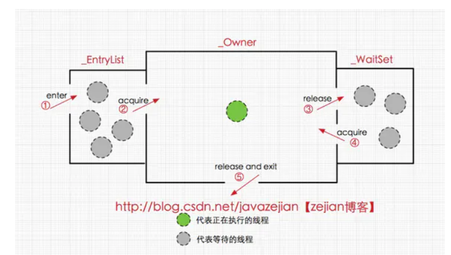

#### 同步代码块

``` java
public class SyncCodeBlock {
    public int i;
    public void syncTask(){
        synchronized (this){
            i++;
        }
    }
}
```

编译上述代码并使用javap反编译后得到字节码如下(这里我们省略一部分没有必要的信息)：

``` java
public class com.fufu.concurrent.SyncCodeBlock {
  public int i;

  public com.fufu.concurrent.SyncCodeBlock();
    Code:
       0: aload_0
       1: invokespecial #1                  // Method java/lang/Object."<init>":()V
       4: return

  public void syncTask();
    Code:
       0: aload_0
       1: dup
       2: astore_1
       3: monitorenter                   //注意此处，进入同步方法
       4: aload_0
       5: dup
       6: getfield      #2                  // Field i:I
       9: iconst_1
      10: iadd
      11: putfield      #2                  // Field i:I
      14: aload_1
      15: monitorexit                    //注意此处，退出同步方法
      16: goto          24
      19: astore_2
      20: aload_1
      21: monitorexit                    //注意此处，退出同步方法
      22: aload_2
      23: athrow
      24: return
    Exception table:
       from    to  target type
           4    16    19   any
          19    22    19   any
}
```

从字节码中可知同步语句块的实现使用的是 **momitoreneter** 和  **monitorexit** 指令， 其中 **momitoreneter** 指令指向同步代码块的开始位置， **monitorexit** 指令则指明同步代码块的同步位置，当执行  **momitoreneter** 指令时，当前线程将试图获取 objectref(即对象锁) 所对应的 monitor 的持有权，当 objectref 的  monitor 的计数器为0，那么线程可以成功获取 monitor ，并将计数器设置为1，取锁成功。
如果当前线程已经拥有 objectref 的 monitor 的持有权， 那它可以重入这个 monitor  （所以sychonized 是可重入锁）， 重入时计数器的值也会加 1 。 倘若其他线程已经拥有了  objectref  的 monitor 的所有权，那当前线程将被阻塞，直到正在执行线程执行完毕， 即  **monitorexit** 指令被执行，执行线程将释放monitor(锁)， 并设置计数器减 1 ，直到计数器为0 时，其他线程将会有机会持有 monitor 。

值得注意的是编译器将会确保无论方法通过何种方式完成，方法中调用过的每条 **momitoreneter** 指令都有执行其对应 **monitorexit** 指令，而无论这个方法是正常结束还是异常结束。为了保证在方法异常完成时 **momitoreneter** 和 **monitorexit** 指令依然可以正确配对执行，编译器会自动产生一个异常处理器，这个异常处理器声明可处理所有的异常，它的目的就是用来执行 **monitorexit** 指令。从字节码中也可以看出多了一个**monitorexit** 指令，它就是异常结束时被执行的释放monitor 的指令。

#### 同步方法

``` java
public class SyncMethod {
   public int i;
   public synchronized void syncTask(){
           i++;
   }
}
```

方法级的同步是隐式，即无需通过字节码指令来控制的，它实现在方法调用和返回操作之中。JVM可以从方法常量池中的方法表结构(method_info Structure) 中的 ACC_SYNCHRONIZED 访问标志区分一个方法是否同步方法。当方法调用时，调用指令将会 检查方法的 ACC_SYNCHRONIZED访问标志是否被设置，如果设置了，执行线程将先持有monitor（虚拟机规范中用的是管程一词），然后再执行方法，最后再方法完成(无论是正常完成还是非正常完成)时释放monitor。在方法执行期间，执行线程持有了monitor，其他任何线程都无法再获得同一个monitor。如果一个同步方法执行期间抛出了异常，并且在方法内部无法处理此异常，那这个同步方法所持有的monitor将在异常抛到同步方法之外时自动释放。下面我们看看字节码层面如何实现：

``` java 
  //省略没必要的字节码
  //==================syncTask方法======================
  public synchronized void syncTask();
    descriptor: ()V
    //方法标识ACC_PUBLIC代表public修饰，ACC_SYNCHRONIZED指明该方法为同步方法
    flags: ACC_PUBLIC, ACC_SYNCHRONIZED
    Code:
      stack=3, locals=1, args_size=1
         0: aload_0
         1: dup
         2: getfield      #2                  // Field i:I
         5: iconst_1
         6: iadd
         7: putfield      #2                  // Field i:I
        10: return
      LineNumberTable:
        line 12: 0
        line 13: 10
```

从字节码中可以看出，synchronized修饰的方法并没有monitorenter指令和monitorexit指令，取得代之的确实是ACC_SYNCHRONIZED标识，该标识指明了该方法是一个同步方法，JVM通过该ACC_SYNCHRONIZED访问标志来辨别一个方法是否声明为同步方法，从而执行相应的同步调用。这便是synchronized锁在同步代码块和同步方法上实现的基本原理。

2种同步方式本质上没有区别，只是方法的同步是一种隐式的方式来实现，无需通过字节码来完成。两个指令的执行是JVM通过调用操作系统的互斥原语mutex来实现，被阻塞的线程会被挂起、等待重新调度，会导致“用户态和内核态”两个态之间来回切换，对性能有较大影响。


https://www.cnblogs.com/aspirant/p/11470858.html


## Synchronized 锁升级

无锁态（刚刚new 出对象） =>    偏向锁   =>    轻量级锁  （自旋锁）  =>  重量级锁

下面是对象头中的  **markword**

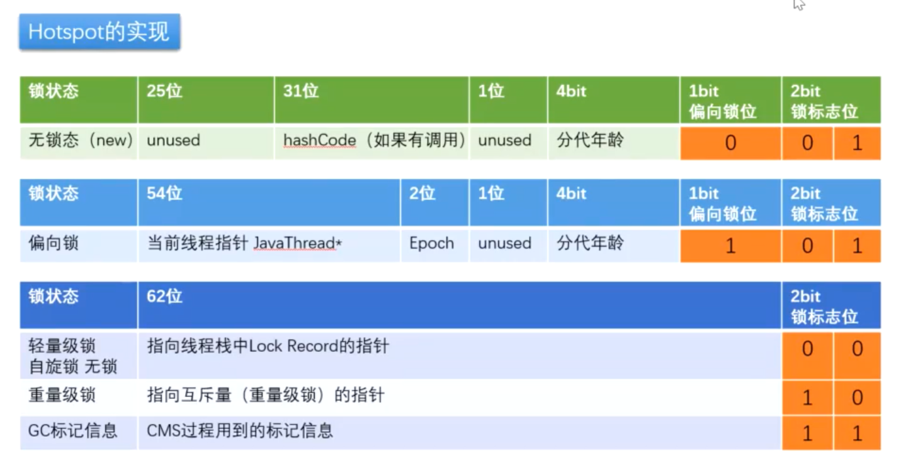

unserd 就是代表没有使用!

### 无锁态 -> 偏向锁

偏向锁会偏向第一次访问的线程，当线程获取锁对象时，会在java对象头markword中记录偏向锁的threadID，并不会主动释放偏向锁。当同一个线程再次获取锁时会比较当前的threadID与对象头中的threadID是否一致。如果一致则不需要通过CAS来加锁、解锁。如果不一致并且线程还需要持续持有锁，则暂停当前线程撤销偏向锁，升级为轻量级锁。如果不在需要持续持有锁则锁对象头设为无锁状态，重新设置偏向锁。

偏向锁过程：

> 1. 访问Mark Word中偏向锁的标识是否设置成1，锁标识位是否为01，确认偏向状态
> 2. 如果为可偏向状态，则判断当前线程ID是否为偏向线程
> 3. 如果偏向线程未只想当前线程，则通过cas操作竞争锁，如果竞争成功则操作Mark Word中线程ID设置为当前线程ID
> 4. 如果cas偏向锁获取失败，则挂起当前偏向锁线程，偏向锁升级为轻量级锁

### 偏向锁- > 轻量级锁 -> 重量级锁

轻量级锁由偏向锁升级而来，偏向锁运行在一个线程同步块时，第二个线程加入锁竞争的时候，偏向锁就会升级为轻量级锁。

轻量级锁过程：

> 1. 线程由偏向锁升级为轻量级锁时，会先把锁的对象头MarkWord复制一份到线程的栈帧中，建立一个名为锁记录空间（Lock Record），用于存储当前Mark Word的拷贝。
> 2. 虚拟机使用CAS操作尝试将对象的Mark Word指向Lock Record的指针，并将Lock record里的owner指针指对象的Mark Word。
> 3. 如果CAS操作成功，则该线程拥有了对象的轻量级锁。第二个线程CAS自选锁等待锁线程释放锁。
> 4. 如果多个线程竞争锁，轻量级锁要升级为重量级锁，Mark Word中存储的就是指向重量级锁（互斥量）的指针。其他等待线程进入阻塞状态。（有线程超过10次自旋，或者自旋线程超过CPU核数的一半，那么就会升级成重量级锁）


### synchronized的锁升级过程：

1. 检测Mark Word里面是不是当前线程的ID，如果是，表示当前线程处于偏向锁
2. 如果不是，则使用CAS将当前线程的ID替换Mard Word，如果成功则表示当前线程获得偏向锁，置偏向标志位1
3. 如果失败，则说明发生竞争，撤销偏向锁，进而升级为轻量级锁。
4. 当前线程使用CAS将对象头的Mark Word替换为锁记录指针，如果成功，当前线程获得锁
5. 如果失败，表示其他线程竞争锁，当前线程便尝试使用自旋来获取锁。
6. 如果自旋成功则依然处于轻量级状态。
7. 如果自旋失败，则升级为重量级锁。


## synchronized 的总结   :

* A线程先持有了object对象的lock锁，但是B线程可以以异步的方式调用object对象中的非synchronized类型的方法
* A线程先持有了object对象的lock锁，B线程如果想在这段时间内调用object对象中的synchronized类型的方法，则需要等待，也就是同步！
* 在方法声明处添加synchronized并不是所方法，而是锁当前类的对象。 在Java中并没有 “锁方法” 的说法，只有 “将对象作为锁” 的说法。
* 在Java 中， “锁” 就是 ”对象“，“对象” 可以映射成 “锁”。那个线程拿到这把锁，哪个线程就可以执行这个对象中的synchronized的同步方法
* 普通同步方法（实例方法），锁是当前实例对象 ，进入同步代码前要获得当前实例的锁
* 静态同步方法，锁是当前类的class对象 ，进入同步代码前要获得当前类对象的锁


**注意注意！！！ **

如果synchronized 锁住的对象后面变化的话，那么 后面锁住的对象和前面已锁的对象就不一样了 ！！  所以他们之间可能就不存在 同步关系了！

下面代码就 验证了此关系！！    在A线程锁住以后，将锁住的对象换值，那么后面B运行时锁住的对象和A锁住的对象不一样。所以A和B之间就没有同步关系了。  当然如果你锁住的是一个复杂的对象，例如Person。Person 中有名字等属性，如果你锁住Person，在A中修改Person中name属性或其他属性的值，是不会有什么改变的！！Person 的地址引用是没有发生变化的！！

``` java
public class updateObjectThread {
    public static void main(String[] args) {
        updateThread updateThread1 = new updateThread();
        updateThread1.setName("A");
        updateThread updateThread2 = new updateThread();
        updateThread2.setName("B");
        updateThread1.start();
        try {
            Thread.sleep(50);
        } catch (InterruptedException e) {
            e.printStackTrace();
        }
        updateThread2.start();
    }
}
class updateThread extends Thread{

    static  String str = "123";
    @Override
    public void run() {

        synchronized (str){
            str = "456";
            System.out.println(Thread.currentThread().getName() + " begin" +System.currentTimeMillis());
            try {
                sleep(2000);
            } catch (InterruptedException e) {
                e.printStackTrace();
            }
            System.out.println(Thread.currentThread().getName() +" end" +System.currentTimeMillis());

        }

    }
}
```


**注意注意！！！！** 
synchronized  的锁对象 不能用 String  Integer Long   因为它们是有常量池的！！！  所以即使不是一个方法内或一个jar包下的程序，如果你都锁了 “123” 那么都相当于 同一个 锁对象！！  这样程序 运行可能 就有  问题了！！


## 八锁现象

其实主要就是看 锁的对象 是不是同一个。如果是同一个那么他们之间就是同步的！！！

``` java
/*
 * 题目：判断打印的 "one" or "two" ？
 * 
 * 1. 两个普通同步方法，两个线程，标准打印， 打印? //one  two
 * 2. 新增 Thread.sleep() 给 getOne() ,打印? //one  two
 * 3. 新增普通方法 getThree() , 打印? //three  one   two
 * 4. 两个普通同步方法，两个 Number 对象，打印?  //two  one
 * 5. 修改 getOne() 为静态同步方法，打印?  //two   one
 * 6. 修改两个方法均为静态同步方法，一个 Number 对象?  //one   two
 * 7. 一个静态同步方法，一个非静态同步方法，两个 Number 对象?  //two  one
 * 8. 两个静态同步方法，两个 Number 对象?   //one  two
 * 
 * 线程八锁的关键：
 * ①非静态方法的锁默认为  this,  静态方法的锁为 对应的 Class 实例
 * ②某一个时刻内，只能有一个线程持有锁，无论几个方法。
 */
public class TestThread8Monitor {

    public static void main(String[] args) {
        Number number = new Number();
        Number number2 = new Number();

        new Thread(new Runnable() {
            @Override
            public void run() {
                number.getOne();
            } 
        }).start();

        new Thread(new Runnable() {
            @Override
            public void run() {
//              number.getTwo();
                number2.getTwo();
            }
        }).start();

        /*new Thread(new Runnable() {
            @Override
            public void run() {
                number.getThree();
            }
        }).start();*/

    }

}

class Number{

    public static synchronized void getOne(){//Number.class
        try {
            Thread.sleep(3000);
        } catch (InterruptedException e) {
        }

        System.out.println("one");
    }

    public synchronized void getTwo(){//this
        System.out.println("two");
    }

    public void getThree(){
        System.out.println("three");
    }

}
————————————————
版权声明：本文为CSDN博主「超超级钢铁侠」的原创文章，遵循CC 4.0 BY-SA版权协议，转载请附上原文出处链接及本声明。
原文链接：https://blog.csdn.net/qq_23851075/java/article/details/74611106
```


“可重入”，可重入就是说某个线程已经获得某个锁，那么这个线程可以调用这个锁锁住的其他方法！
synchronized也是可重入锁！！

重入锁实现可重入性原理或机制是：每一个锁关联一个线程持有者和计数器，当计数器为 0 时表示该锁没有被任何线程持有，那么任何线程都可能获得该锁而调用相应的方法；当某一线程请求成功后，JVM会记下锁的持有线程，并且将计数器置为 1；此时其它线程请求该锁，则必须等待；而该持有锁的线程如果再次请求这个锁，就可以再次拿到这个锁，同时计数器会递增；当线程退出同步代码块时，计数器会递减，如果计数器为 0，则释放该锁。

## Lock (锁)

 从JDK5.0开始，java提供的更强大的线程同步机制，通过显示定义同步锁来实现同步。同步锁使用Lock对象充当。
java.util.concurrent.locks.Lock接口是控制多个线程对共享资源进行访问的工具。
锁提供了对共享资源的独占访问，每次只能有一个线程对Lock对象加锁，线程开始访问共享资源之前应先获得Lock对象 ReentrantLock类（可重入锁）实现了Lock，它拥有与synchronized相同的并发性和内存语义，在实现线程安全的控制中，比较常用的是ReentrantLock,可以显式加锁、释放锁。
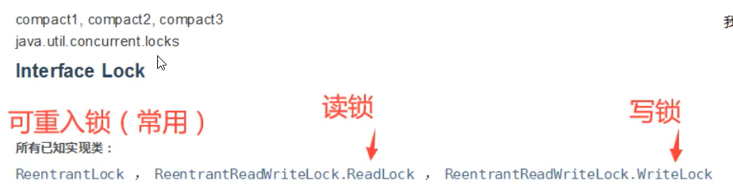

### ReentranLock  可重入锁

ReentranLock  的一般使用

1. new ReentranLock
2. 调用lock.  **lock()**方法:上锁
3. 在finally 中 调用lock.**unlock()**方法：释放锁。  （lock 必须要自己释放锁！！即使出了异常也要手动释放）

如果直接new ReentranLock()  那么 默认是 非公平锁！  如果new  ReentranLock(true) 那么就是公平锁。
公平锁 （FairSync）：公平锁获取锁的时候，进入排队。 先来后到， 
非公平锁 （NoFairSync）：非公平锁线程尝试插队，如果插队不成功再进行排队。可以插队。

ReentranLock   中 tryLock()方法是有返回值的，返回值是Boolean类型。它表示的是用来尝试获取锁：成功获取则返回true；获取失败则返回false，这个方法无论如何都会立即返回。不会像synchronized一样，一个线程获取锁之后，其他锁只能等待那个线程释放之后才能有获取锁的机会
tryLock()有一个重载方法，这个方法就是：**tryLock(long timeout, TimeUnit unit)**方法，timeout 等待锁的时间，unit是才是参数的时间单位。这个方法去限定了一个尝试获取锁的时间。获取锁成功则返回true；当失败是分为两种情况：在参数范围内，则不会立即返回值，会等待一段时间，这个时间就是传入的具体参数值，在这个时间内获取锁成功，则依旧返回true；当过了参数范围后，还是获取锁失败，则立即返回false。

``` java
//实例化Lock接口对象
Lock lock = new ReentranLock();
//根据尝试获取锁的值来判断具体执行的代码
if(lock.tryLock()) {
     try{
         //处理任务
     }catch(Exception ex){
         
     }finally{
     	//当获取锁成功时最后一定要记住finally去关闭锁
         lock.unlock();   //释放锁
     } 
}else {
	//else时为未获取锁，则无需去关闭锁
    //如果不能获取锁，则直接做其他事情
}
原文链接：https://blog.csdn.net/qq_43323776/java/article/details/8293900
```

ReenrabLock  还可以中断，  ReentrantLock.Interrruptibly(); 能够中断等待获取锁的线程。当两个线程同时通过lock.lockInterruptibly()获取某个锁时，假若此时线程A获取到了锁，而线程B只有等待，那么对线程B调用threadB.interrupt()方法能够中断线程B的等待过程。

``` java
public class LockTest {
 
    private Lock lock = new ReentrantLock();
 
    public void doBussiness() {
        String name = Thread.currentThread().getName();
        try {
            System.out.println(name + " 开始获取锁");
            lock.lockInterruptibly();  //中断的方式获取锁
            System.out.println(name + " 得到锁");
            System.out.println(name + " 开工干活");
            for (int i=0; i<5; i++) {
                Thread.sleep(1000);
                System.out.println(name + " : " + i);
            }
        } catch (InterruptedException e) {
            System.out.println(name + " 被中断");
            System.out.println(name + " 做些别的事情");
        } finally {
            try {
                lock.unlock();
                System.out.println(name + " 释放锁");
            } catch (Exception e) {
                System.out.println(name + " : 没有得到锁的线程运行结束");
            }
        }
    }
 
    public static void main(String[] args) throws InterruptedException {
        LockTest lockTest = new LockTest();
        Thread t0 = new Thread(lockTest::doBussiness);
        Thread t1 = new Thread(lockTest::doBussiness);
        // 启动线程t1
        t0.start();
        Thread.sleep(10);
        // 启动线程t2
        t1.start();
        Thread.sleep(100);
        // 线程t1没有得到锁，中断t1的等待
        t1.interrupt();
    }
}
```


### Condition 实际上是 java.util.concurrent.locks 中的一个接口。

**调用Lock对象的newCondition()对象创建而来**

Condition 将 Object 监视器方法（wait、notify 和 notifyAll）分解成截然不同的对象，以便通过将这些对象与任意 Lock 实现组合使用，为每个对象提供多个等待 set（wait-set）。其中，Lock 替代了 synchronized 方法和语句的使用，Condition 替代了 Object 监视器方法的使用。其中，Lock 替代了 synchronized 方法和语句的使用，Condition 替代了 Object 监视器方法的使用。

在Condition中，用await()替换wait()，用signal()替换notify()，用signalAll()替换notifyAll()，传统线程的通信方式，Condition都可以实现，这里注意，Condition是被绑定到Lock上的，**调用Condition的await()和signal()方法，都必须在lock保护之内，就是说必须在lock.lock()和lock.unlock之间才可以使用**

而synchronized关键字就相当于整个Lock对象中只有一个Condition实例，所有的线程都注册在它一个身上。如果执行notifyAll()方法的话就会通知所有处于等待状态的线程这样会造成很大的效率问题，而Condition实例的signalAll()方法 只会唤醒注册在该Condition实例中的所有等待线程

### ReadWriteLock  读写锁  （接口）

ReadWriteLock   只有2个方法 

``` java
public interface ReadWriteLock {
    /**
     * 返回读锁
     */
    Lock readLock();

    /**
     * 返回写锁
     */
    Lock writeLock();
}
```

**ReetrantReadWriteLock ** 实现了ReadWriteLock接口并添加了可重入的特性.
ReentrantLock是一个排他锁，同一时间只允许一个线程访问，而ReentrantReadWriteLock允许多个读线程同时访问，但不允许写线程和读线程、写线程和写线程同时访问。相对于排他锁，提高了并发性(读读共享，读写互斥，写写互斥)，也就是说ReetrantReadWriteLock读写锁的实现中，读锁使用共享模式；写锁使用独占模式；读锁可以在没有写锁的时候被多个线程同时持有，写锁是独占的。

读写锁 其实操作和 ReentranLock差不多  只不过需要 ReentrantReadWriteLock.readLock() 或者ReentrantReadWriteLock.writeLock()  然后操作锁对象罢了。


## 线程通信

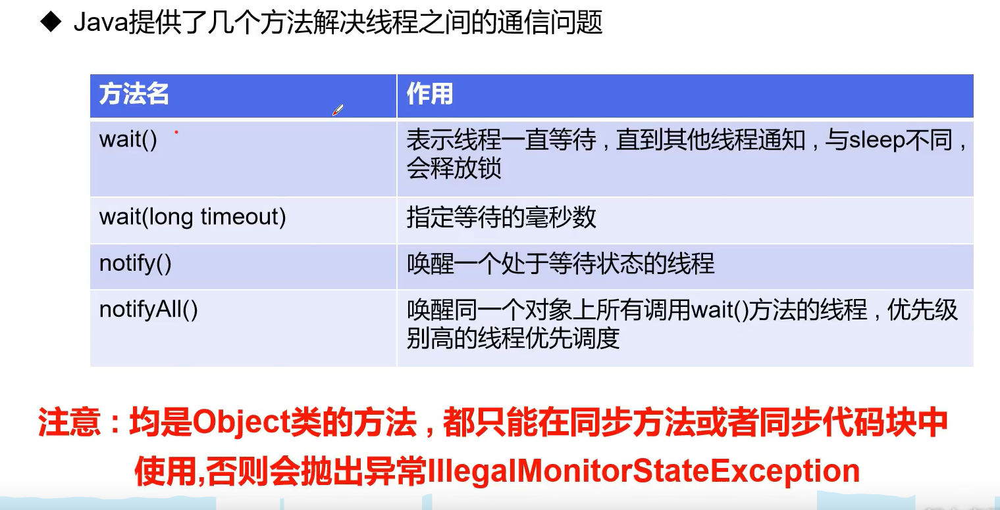


自己写一个 生产者消费者代码！！！
线程1输入1~5  然后线程2输出6~10 然后线程3输出11~15.三个线程依次执行，输出到50即可！！！   （利用condition 可以非常简单是实现 !!!）

**wait 的虚假唤醒**

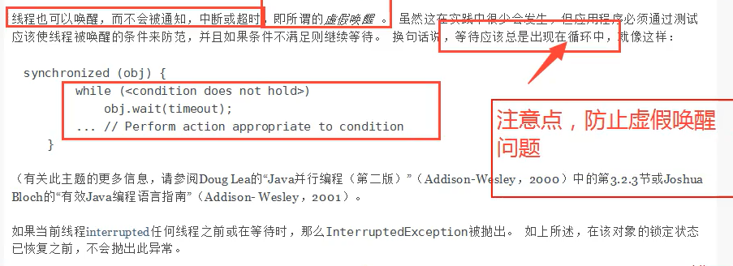

就是用if判断的话，唤醒后线程会从wait之后的代码开始运行，但是不会重新判断if条件，直接继续运行if代码块之后的代码，而如果使用while的话，也会从wait之后的代码运行，但是唤醒后会重新判断循环条件，如果不成立再执行while代码块之后的代码块，成立的话继续wait。这也就是为什么用while而不用if的原因了，因为线程被唤醒后，执行开始的地方是wait之后。


## 线程池

背景 ： 经常创建和销毁、使用量特别大的资源，比如并发情况下的线程对性能影响非常大。
思路 ： 提前创建好多个线程，放入线程池中，使用时直接获取，使用完了以后放回池中。可以避免频繁创建销毁线程。可以实现线程的重复利用。
好处 ：

* 提高响应速度（减少了创建新线程的时间）
* 降低资源消耗 （重复利用线程池中线程，不需要每次都创建）
* 便于线程管理  （corePoolSize 核心池大小    maximumPoolSize 最大线程数    keepAliveTime  线程没有任务时最多保持多次时间后会终止）

ExecutorService ： 线程池接口。常见子类 ThreadPoolExecutor

* void execute(Runnable command)   执行任务/命令  没有返回值，一般用于执行Runnable
* <T>  Future<T> submit(Callable<T>  task)  执行任务，有返回值，一般用于执行Callable
* void  shutdown()  关闭连接池  

Executors ： 工具类，线程池的工厂类

``` java
Executors.newSingleThreadExecutor();   //单个线程
Executors.newFixedThreadExecutor(nThread); //创建一个固定的线程池大小  线程个数nthread
Executors.newCachedThreadExecutor();    //可伸缩的

//他们的本质 都是  ThreadPoolExecutor
public ThreadPoolExecutor(int corePoolSize,   //线程池中核心线程数的最大值
                          int maximumPoolSize,  //线程池中能拥有最多线程数
                          long keepAliveTime,   //表示空闲线程的存活时间。
                          TimeUnit unit,        //表示keepAliveTime的单位。
                          BlockingQueue<Runnable> workQueue,  //阻塞队列
                          ThreadFactory threadFactory,      //线程工厂 创建线程的，一般不动
                          RejectedExecutionHandler handler // 表示当workQueue已满，且池中的线程数达到maximumPoolSize时，线程池拒绝添加新任务时采取的策略
                         )
{。。。}

```

 我们现在通过向线程池添加新的任务来说明着三者之间的关系。

   （1）如果没有空闲的线程执行该任务且当前运行的线程数少于corePoolSize，则添加新的线程执行该任务。

   （2）如果没有空闲的线程执行该任务且当前的线程数等于corePoolSize同时阻塞队列未满，则将任务入队列，而不添加新的线程。

   （3）如果没有空闲的线程执行该任务且阻塞队列已满同时池中的线程数小于maximumPoolSize，则创建新na的线程执行任务。

   （4）如果没有空闲的线程执行该任务且阻塞队列已满同时池中的线程数等于maximumPoolSize，则根据构造函数中的handler指定的策略来拒绝新的任务。

handler一般可以采取以下四种取值。

| ThreadPoolExecutor.AbortPolicy()         | 抛出RejectedExecutionException异常                           |
| ---------------------------------------- | ------------------------------------------------------------ |
| ThreadPoolExecutor.CallerRunsPolicy()    | 由向线程池提交任务的线程来执行该任务（哪个线程提交的任务那么就把这个任务就交给这个提交任务的线程处理） |
| ThreadPoolExecutor.DiscardOldestPolicy() | 抛弃最旧的任务（最先提交而没有得到执行的任务）               |
| ThreadPoolExecutor.DiscardPolicy()       | 抛弃当前的任务                                               |

workQueue：它决定了缓存任务的排队策略。对于不同的应用场景我们可能会采取不同的排队策略，这就需要不同类型的阻塞队列，在线程池中常用的阻塞队列有以下2种：

（1）SynchronousQueue<Runnable>：此队列中不缓存任何一个任务。向线程池提交任务时，如果没有空闲线程来运行任务，则入列操作会阻塞。当有线程来获取任务时，出列操作会唤醒执行入列操作的线程。从这个特性来看，SynchronousQueue是一个无界队列，因此当使用SynchronousQueue作为线程池的阻塞队列时，参数maximumPoolSizes没有任何作用。

  （2）LinkedBlockingQueue<Runnable>：顾名思义是用链表实现的队列，可以是有界的，也可以是无界的，但在Executors中默认使用无界的。

线程工厂  用 Executors中的defaultThreadFactory()线程工厂

最大线程的定义 ：

* CPU密集型， CPU是几核的那么就设置几个线程！！  可以保持CPU效率最高
  *  动态获取服务器的CPU核数 : Runtime.getRuntime().availablePricessors();
* IO密集型，判断你程序中释放耗 IO 的线程个数。


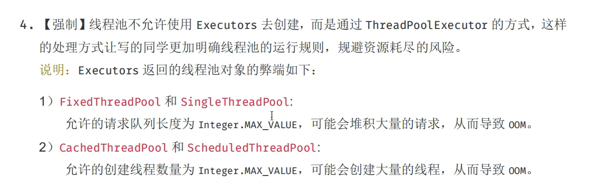


https://blog.csdn.net/jubaoquan/article/details/79198780

### 并发安全的集合

### list  

*  **Vector**<>();
* **Collections.synchronizedList(new ArryList<>()) **    //通过工具类把  ArrayList 的每一个方法都加上锁！！
* **CopyOnWriteArrayList<>()**

补充 ：  CopyOnWrite    写入时复制
简单来说，就是平时查询的时候，都不需要加锁，随便访问，只有在写入/删除的时候，才会从原来的数据复制一个副本出来，然后修改这个副本，最后把原数据替换成当前的副本。修改操作的同时，读操作不会被阻塞，而是继续读取旧的数据。这点要跟读写锁区分一下。  复制出来的副本就比原来大1！！！

CopyOnWriteArrayList  get 是不加锁的！  add 的时候加的是lock（ReentrantLock) 锁。    CopyOnWriteArrayList  应该用于读多写少的情况，如果频繁的写对于CopyOnWriteArrayList  的开销是非常大的，无论是时间还是空间 上。因为他每一次的添加都需要复制！！

### set

* **Collections.synchronizedList(new HashSet<>())**
* **CopyOnWriteSet<>()**

### map

* **HashTable<>()**
* **ConcurrentHashMap()**

 


## 常用 的 集合辅助类

|        类        |                             功能                             | 说           明 |
| :--------------: | :----------------------------------------------------------: | :-------------: |
|  CyclicBarrier   | 允许线程集等待直至其中预定数目的线程到达一个公告障栅（barrrier），然后可以选择执行一个处理障栅的动作 |                 |
|      Phaser      |             类似与循环障栅，不过有一个可变的计数             |                 |
|  CountDownLatch  |                允许线程集等待直到计数器减到0                 |                 |
|    Exchanger     |          允许两个线程在要交换的对象准备好时交换对象          |                 |
|    Semaphore     |              允许线程集等待直到允许继续允许位置              |                 |
| SynchronousQueue |               允许一个线程把对象交给另一个线程               |                 |


### 障栅 CyclicBarrier 

CyclicBarrier  实现了一个集结点也就是障栅。考虑到大量的线程运行时再一次计算的不同部分的情形。当所有部分都准备好时，需要把结果组合起来。当一个线程完成了它的那部分以后，我们让它允许到障栅处。一旦所有线程都达到了这个障栅，那么障栅撤销，线程继续允许。

``` java
// nthreads  最大线程数 int
//barrierAction 是可选参数
//可以提供一个可选的 障栅 动作（BarrierAction 实现Runnable接口）， 当所有线程到达障栅的时候就会执行这个工作
CyclicBarrier cyclicBarrier  = new CyclicBarrier(nthreads,barrierAction);
//每一个线程
public void run(){
    dowork....;
    cyclicBarrier.await();
    wake  up....;
}
```

### 倒计时门栓  CountDownLatch

countDownLatch这个类使一个线程等待其他线程各自执行完毕后再执行。
是通过一个计数器来实现的，计数器的初始值是线程的数量。每当一个线程执行完毕后，计数器的值就-1，当计数器的值为0时，表示所有线程都执行完毕，然后在闭锁上等待的线程就可以恢复工作了。

```java
//countDownLatch类中只提供了一个构造器
//参数count为计数值
public CountDownLatch(int count) {  };  
//调用await()方法的线程会被挂起，它会等待直到count值为0才继续执行
public void await() throws InterruptedException { };   
//和await()类似，只不过等待一定的时间后count值还没变为0的话就会继续执行
public boolean await(long timeout, TimeUnit unit) throws InterruptedException { };  
//将count值减1
public void countDown() { };  
```

示例

``` java
public class CountDownLatchTest {
    public static void main(String[] args) {
        final CountDownLatch latch = new CountDownLatch(2);
        System.out.println("主线程开始执行…… ……");
        //第一个子线程执行
        ExecutorService es1 = Executors.newSingleThreadExecutor();
        es1.execute(new Runnable() {
            @Override
            public void run() {
                try {
                    Thread.sleep(3000);
                    System.out.println("子线程："+Thread.currentThread().getName()+"执行");
                } catch (InterruptedException e) {
                    e.printStackTrace();
                }
                latch.countDown();
            }
        });
        es1.shutdown();
        //第二个子线程执行
        ExecutorService es2 = Executors.newSingleThreadExecutor();
        es2.execute(new Runnable() {
            @Override
            public void run() {
                try {
                    Thread.sleep(3000);
                } catch (InterruptedException e) {
                    e.printStackTrace();
                }
                System.out.println("子线程："+Thread.currentThread().getName()+"执行");
                latch.countDown();
            }
        });
        es2.shutdown();
        System.out.println("等待两个线程执行完毕…… ……");
        try {
            latch.await();
        } catch (InterruptedException e) {
            e.printStackTrace();
        }
        System.out.println("两个子线程都执行完毕，继续执行主线程");
    }
}
```

CountDownLatch是一次性的，计算器的值只能在构造方法中初始化一次，之后没有任何机制再次对其设置值，当CountDownLatch使用完毕后，它不能再次被使用。

### Semaphore  信号量

构造方法

```java
public Semaphore(int permits)
public Semaphore(int permits, boolean fair)
  /**
  *permits 表示许可线程的数量
  *fair 表示公平性，如果这个设为 true 的话，下次执行的线程会是等待最久的线程
  */ 
```

semaphore.acquire() ：从此信号量获取一个许可，如果已经满了，就会等待，等待有资源为止。
semaphore.release() ：释放一个许可，将其返回给信号量。

需要注意的是 Semaphore 只是对资源并发访问的线程数进行监控，并不会保证线程安全。

作用 : 可用于流量控制，限制最大的并发访问数。 多个共享资源互斥的使用。


## 阻塞队列（BlockingQueue）

当试图向队列添加元素而队列已满，或者是想从队列移除元素而队列为空的时候，阻塞队列就会导致线程阻塞。

阻塞队列（BlockingQueue）是一个支持两个附加操作的队列。这两个附加的操作支持阻塞的插入和移除方法

1）支持阻塞的插入方法：意思是当队列满时，队列会阻塞插入元素的线程，直到队列不满。
2）支持阻塞的移除方法：意思是在队列为空时，获取元素的线程会等待队列变为非空


**抛出异常**：是指当阻塞队列满时候，再往队列里插入元素，会抛出 IllegalStateException("Queue full") 异常。当队列为空时，从队列里获取元素时会抛出 NoSuchElementException 异常 。
**返回特殊值**：插入方法会返回是否成功，成功则返回 true。移除方法，则是从队列里拿出一个元素，如果没有则返回 null
**一直阻塞**：当阻塞队列满时，如果生产者线程往队列里 put 元素，队列会一直阻塞生产者线程，直到拿到数据，或者响应中断退出。当队列空时，消费者线程试图从队列里 take 元素，队列也会阻塞消费者线程，直到队列可用。
**超时退出**：当阻塞队列满时，队列会阻塞生产者线程一段时间，如果超过一定的时间，生产者线程就会退出。

阻塞队列:

**ArrayBlockingQueue**和**LinkedBlockingQueue**是最为常用的阻塞队列，前者使用一个有边界的数组来作为存储介质，而后者使用了一个没有边界的链表来存储数据。
**PriorityBlockingQueue**是一个优先阻塞队列。所谓优先队列，就是每次从队队列里面获取到的都是队列中优先级最高的，对于优先级，PriorityBlockingQueue需要你为插入其中的元素类型提供一个Comparator，PriorityBlockingQueue使用这个Comparator来确定元素之间的优先级关系。底层的数据结构是堆，也就是我们数据结构中的那个堆。
**DelayQueue**是一个延时队列，所谓延时队列就是消费线程将会延时一段时间来消费元素。

## SynchronousQueue 同步队列

是最为复杂的阻塞队列。SynchronousQueue和前面分析的阻塞队列都不同，因为SynchronousQueue不存在容量的说法，任何插入操作都需要等待其他线程来消费，否则就会阻塞等待，看到这种队列心里面估计就立马能联想到生产者消费者的这种模式了，没错，就可以使用这个队列来实现。
synchronized 不存储元素，put了一个元素，那么必须从里面先take取出来，否则不能再put进去。


## ForkJoin

Java提供Fork/Join框架用于并行执行任务，它的思想就是讲一个大任务分割成若干小任务，最终汇总每个小任务的结果得到这个大任务的结果。这种思想和MapReduce很像

主要有两步：

- 第一、任务切分；
- 第二、结果合并

它的模型大致是这样的：线程池中的每个线程都有自己的工作队列（PS：这一点和ThreadPoolExecutor不同，ThreadPoolExecutor是所有线程公用一个工作队列，所有线程都从这个工作队列中取任务），当自己队列中的任务都完成以后，会从其它线程的工作队列中偷一个任务执行，这样可以充分利用资源。

### 工作窃取（work-stealing）

工作窃取（work-stealing）算法是指某个线程从其他队列里窃取任务来执行。工作窃取的运行流程图如下：

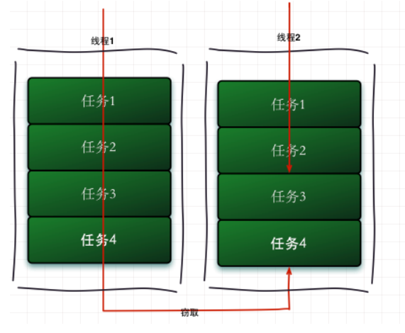


那么为什么需要使用工作窃取算法呢？

假如我们需要做一个比较大的任务，我们可以把这个任务分割为若干互不依赖的子任务，为了减少线程间的竞争，于是把这些子任务分别放到不同的队列里，并为每个队列创建一个单独的线程来执行队列里的任务，线程和队列一一对应，比如A线程负责处理A队列里的任务。但是有的线程会先把自己队列里的任务干完，而其他线程对应的队列里还有任务等待处理。干完活的线程与其等着，不如去帮其他线程干活，于是它就去其他线程的队列里窃取一个任务来执行。而在这时它们会访问同一个队列，所以为了减少窃取任务线程和被窃取任务线程之间的竞争，通常会使用双端队列，被窃取任务线程永远从双端队列的头部拿任务执行，而窃取任务的线程永远从双端队列的尾部拿任务执行。

工作窃取算法的优点是充分利用线程进行并行计算，并减少了线程间的竞争，其缺点是在某些情况下还是存在竞争，比如双端队列里只有一个任务时。并且消耗了更多的系统资源，比如创建多个线程和多个双端队列。

### ForkJoinPool

既然任务是被逐渐的细化的，那就需要把这些任务存在一个池子里面，这个池子就是ForkJoinPool，它与其它的ExecutorService区别主要在于它使用“工作窃取“。

ForkJoinTask就是ForkJoinPool里面的每一个任务。他主要有两个子类：RecursiveAction和RecursiveTask。然后通过fork()方法去分配任务执行任务，通过join()方法汇总任务结果。
（1）RecursiveAction 一个递归无结果的ForkJoinTask（没有返回值）
（2）RecursiveTask   一个递归有结果的ForkJoinTask（有返回值）

ForkJoinPool由ForkJoinTask数组和ForkJoinWorkerThread数组组成，ForkJoinTask数组负责存放程序提交给ForkJoinPool的任务，而ForkJoinWorkerThread数组负责执行这些任务。

https://blog.csdn.net/m0_37542889/article/details/92640903

## 重排序

一个好的内存模型会放松对处理器和编译规则的束缚，也就是说软件技术和硬件技术都为同一个目标而进行奋斗 ： 在不改变程序执行结果的前提下，尽可能的提高并行度。JMM对底层尽量减少约束，使其能够发挥自身优势。因此，在执行程序时，为了提高性能，编译器和处理器常常会对指令进行排序，一般重排序可以分为下面三种：

1. 编译器优化的重排序。编译器在不改变单线程程序的语义前提下，可以重新安排语句的执行顺序；
2. 指令级并行的重排序。现代处理器采用了 指令级并行技术来将多条指令重叠执行。如果 **不存在数据依赖性**，处理器可以改变语句对应机器指令的执行顺序；
3. 内存系统的重排序。由于处理器使用缓存和 读/写缓冲区，这使得加载和存储操作上看上去可能是在乱序执行的。

如图， 1属于编译器排序，而2和3统称为处理器重排序。这些重排序会导致线程安全问题，一个经典例子 DLC 问题。**针对编译器重排序**，JMM的编译器重排序规则会禁止一些**特定类型的编译器重排序**；**针对处理器重排序**，编译器在生成指令序列的时候会通过**插入内存屏障指令来禁止某些特殊的处理器重排序**。

那么什么情况下，不能进行重排序了？下面就来说说数据依赖性。有如下代码：

``` java
double pi = 3.14 //A
double r = 1.0 //B
double area = pi * r * r //C
```

这是一个计算圆面积的代码，由于A,B之间没有任何关系，对最终结果也不会存在关系，它们之间执行顺序可以重排序。因此可以执行顺序可以是A->B->C或者B->A->C执行最终结果都是3.14，即A和B之间没有数据依赖性。具体的定义为：**如果两个操作访问同一个变量，且这两个操作有一个为写操作，此时这两个操作就存在数据依赖性**这里就存在三种情况：1. 读后写；2.写后写；3. 写后读，者三种操作都是存在数据依赖性的，如果重排序会对最终执行结果会存在影响。**编译器和处理器在重排序时，会遵守数据依赖性，编译器和处理器不会改变存在数据依赖性关系的两个操作的执行顺序**。

## as-if-serial

**as-if-serial** 语义的意思是 : :  不管怎么重排序(编译器和处理器为了提高并行度)，(单线程)程序的执行结果不能被被改变。编译器，runtime和处理器都必须遵守 **as-if-serial** 语义。 **as-if-serial** 语义把单线程程序保护起来，，**遵守as-if-serial语义的编译器，runtime和处理器共同为编写单线程程序的程序员创建了一个幻觉：单线程程序是按程序的顺序来执行的**。比如上面计算圆面积的代码，在单线程中，会让人感觉代码是一行一行顺序执行上，实际上A,B两行不存在数据依赖性可能会进行重排序，即A，B不是顺序执行的。as-if-serial语义使程序员不必担心单线程中重排序的问题干扰他们，也无需担心内存可见性问题。

## happens-before规则

上面的内容讲述了重排序原则，一会是编译器重排序一会是处理器重排序，如果让程序员再去了解这些底层的实现以及具体规则，那么程序员的负担就太重了，严重影响了并发编程的效率。因此，JMM为程序员在上层提供了六条规则，这样我们就可以根据规则去推论跨线程的内存可见性问题，而不用再去理解底层重排序的规则。下面以两个方面来说。

#### happens-before定义

happens-before的概念最初由Leslie Lamport在其一篇影响深远的论文（《Time，Clocks and the Ordering of Events in a Distributed System》）中提出 。 

当一个变量被多个线程读取并且至少被一个线程写入时，如果读操作和写操作没有 HB 关系，则会产生数据竞争问题。 要想保证操作 B的线程看到操作 A 的结果（无论 `A` 和 `B` 是否在一个线程），那么在 `A` 和 `B` 之间必须满足 HB 原则，如果没有，将有可能导致重排序。 当缺少 HB 关系时，就可能出现重排序问题。
happens-before 用来阐述操作之间的内存可见性。如果一个操作的执行结果需要对另一个操作可见，那么这两个操作之间必须存在happens-before关系。
还可以理解为  为了解决多线程的内存可见问题，就提出了 happens-before 原则，让线程之间遵守这些原则，同时对编译器的优化进行了一定的约束。

JSR-133 使用 happens-before的概念指定两个线程之间的执行顺序，由于两个操作可以在一个线程之内，也可以在不同的线程之间，因此， JMM 可以通过 happens-before 关系向程序员提供跨线程的内存可见性保证。（如果线程A 的写操作a 与 线程B的读操作b 之间存在 happens-before 关系，尽管a操作和b操作在不同的线程种执行，但是JMM向程序员保证a操作对b操作可见）。具体定义为：

* 如果一个操作 happens-before 另一个操作， 那么第一个操作的执行结果将对第二个操作可见，而且第一个操作的执行顺序排在第二个操作之前。
* 两个操作之间存在 happens-before 关系， 并不意味着Java平台的具体实现必须要按照 happens-before 关系指定的顺序来执行。如果重排序后的执行结果，与按 happens-before 关系来执行的结果一致，那么这种重排序不非法（也就说，JMM允许这种排序）。

上面的**1）是JMM对程序员的承诺**。从程序员的角度来说，可以这样理解happens-before关系：如果A happens-before B，那么Java内存模型将向程序员保证——A操作的结果将对B可见，且A的执行顺序排在B之前。注意，这只是Java内存模型向程序员做出的保证！

上面的**2）是JMM对编译器和处理器重排序的约束原则**。正如前面所言，JMM其实是在遵循一个基本原则：只要不改变程序的执行结果（指的是单线程程序和正确同步的多线程程序），编译器和处理器怎么优化都行。JMM这么做的原因是：程序员对于这两个操作是否真的被重排序并不关心，程序员关心的是程序执行时的语义不能被改变（即执行结果不能被改变）。因此，happens-before关系本质上和as-if-serial语义是一回事。

#### as-if-serial VS happens-before  区别

1. as-if-serial 语义保证单线程内程序的执行结果不被改变。 happens-before 关系保证正确同步的多线程程序的执行结果不会被改变
2. as-if-serial 语义给编写单线程程序的程序员创造了一个幻境：单线程程序是按照程序的顺序来执行的。 happens-before 关系给编写正确同步的多线程程序的程序员创造了一个幻境 ：正确同步的多线程是按照appens-before指定的顺序来执行的。
3. as-if-serial语义和happens-before这么做的目的，都是为了在不改变程序执行结果的前提下，尽可能地提高程序执行的并行度。

### happpens-before 具体规则

一共八项  :  

1. 程序顺序规则 ： 一个线程内的每个操作， happens-before 于该线程内的任意后续操作。  （一个程序内，一段代码的执行结果是有序的。依然会有重排序，但是无论怎么重排序，结果都是按照顺序生成的不会改变）
2. 监视器锁规则 ： 对一个锁的解锁， happens-before  于随后对这个锁的加锁。  （无论单线程环境还是多线程环境，对于用一个锁来说，一个线程对这个锁解锁之后，另一个线程获取了这个锁，则它能看到前一个线程的操作结果）
3. volatie 变量规则 ： 对一个 volatile 域的写， happens-before  于任意后续对这个 volatile 域的读。 （如果一个线程先去写 volatile 变量， 然后一个线程取读这个变量， 那么这个写操作的结果一定对读的这个线程可见）
4. 线程启动( start() )规则 ： 如果线程A执行ThreadB.start()（启动线程B），那么A线程的ThreadB.start()操作happens-before于线程B中的任意操作。  （如果主线程A执行过程中，启动子线程B，那么线程A在启动子线程B之前对共享变量的修改结果对线程B可见）
5. 线程结束( join() ) 规则 ： 如果线程A执行操作ThreadB.join()并成功返回，那么线程B中的任意操作 happens-before 于线程A从ThreadB.join() 操作成功返回。  （在主线程A执行过程中，子线程B终止，那么线程B在终止之前对共享变量的修改结果在线程A中可见）。
6. 线程中断规则 ： 对线程interrupted()方法的调用先行于被中断线程的代码检测到中断时间的发生。
7. 传递性规则 ： 如果A happens-before B，且B happens-before C，那么A happens-before C。
8. 对象finalize规则 ： 一个对象的初始化完成（改造函数执行结束） 先行于 发送它的 finalize() 方法的开始。

https://juejin.cn/post/6844903600318054413#heading-4

## volatile 

*  保证线程可见性
  * 本质就是MESI，缓存一致性协议
*  禁止指令重排序
  * DCL 单例
*   但是 不保证 原子性！

## 

# CAS  (compare and swap)

比较和交换（Conmpare And Swap）是用于实现多线程同步的原子指令。 它将内存位置的内容与给定值进行比较，只有在相同的情况下，将该内存位置的内容修改为新的给定值。 这是作为单个原子操作完成的。 原子性保证新值基于最新信息计算; 如果该值在同一时间被另一个线程更新，则写入将失败。 操作结果必须说明是否进行替换; 这可以通过一个简单的布尔响应（这个变体通常称为比较和设置），或通过返回从内存位置读取的值来完成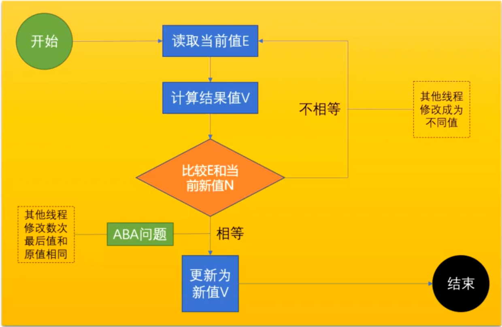

CAS  - ABA问题。当第一个线程执行CAS操作，尚未修改为新值之前，内存中的值已经被其他线程连续修改了两次，使得变量值经历 A -> B -> A的过程。
解决方案：添加版本号作为标识，每次修改变量值时，对应增加版本号； 做CAS操作前需要校验版本号。JDK1.5之后，新增AtomicStampedReference类来处理这种情况。

Java中的 CAS。  我们其实也只是引用了JNI中的接口，CAS的实现是用c++语言实现的！

``` java
    private static final Unsafe unsafe = Unsafe.getUnsafe();
    //state 的 偏移量
	private static long  stateOffset;
   static {
        try {
            stateOffset = unsafe.objectFieldOffset(MyLock.class.getDeclaredField("state"));
        } catch (NoSuchFieldException e) {
            e.printStackTrace();
        }
    }
 

	public final boolean compareAndSwapState(int oldValue,int newValue){
        /**
        * 
	    *public final native boolean compareAndSwapObject
	    				(Object var1, long offset, Object expected, Object var2);	
        *var1为CAS操作的对象，offset为var1某个属性的地址偏移值，expected为期望值，var2为要设置的值，  期望值就是当前内存中的值！！设置值就是更新的值！！
        
        利用JNI来完成 CPU指令的操作
        public final native boolean compareAndSwapInt(Object var1, long offset, int expected, int var2);
        public final native boolean compareAndSwapLong(Object var1, long offset, long expected, long var2);
        *
        */
        return unsafe.compareAndSwapInt(this,stateOffset,oldValue,newValue);
    }


```

``` java
// 再来看看 AtomicInteger 中自增的方法
//这个方法 返回的是 previous value  就是未修改前的值 所以后面返回的是var
public final int getAndIncrement(){
    return unsafe.getAndAddInt(this,valueOffset,1);
}

/*
* var1 
*/
public final int getAndAddInt(Object var1,long var2,int var4){
    int var5;
    do{
       	//获取传入对象需要修改的内存值  内存值就是还未修改前的值
        //也就是我们上面说的期望值E
        var5 = this.getIntVolatile(var1,var2);
        //下面就是调用cas
        //调用JNI 中的 CAS方法，每个线程将自己内存中的内存值M
        //与var5期望值E 做比较。如果相同那么就可以将内存值N更新为 var5+var4
    }while(!this.conpareAndSwpInt(var1,var2,var5,var5+var4));
	return var5;
    
    
}

```


CAS的缺点：

1.CPU开销较大
 在并发量比较高的情况下，如果许多线程反复尝试更新某一个变量，却又一直更新不成功，循环往复，会给CPU带来很大的压力。

2.不能保证代码块的原子性
 CAS机制所保证的只是一个变量的原子性操作，而不能保证整个代码块的原子性。比如需要保证3个变量共同进行原子性的更新，就不得不使用Synchronized了。


# ThreadLocal   线程本地变量


`ThreadLocal` 是 JDK底层提供的一个解决多线程并发问题的工具类,它为每个线程提供了一个本地的副本变量机制，实现了和其它线程隔离，并且这种变量只在本线程的生命周期内起作用，可以减少同一个线程内多个方法之间的公共变量传递的复杂度。

全局观：

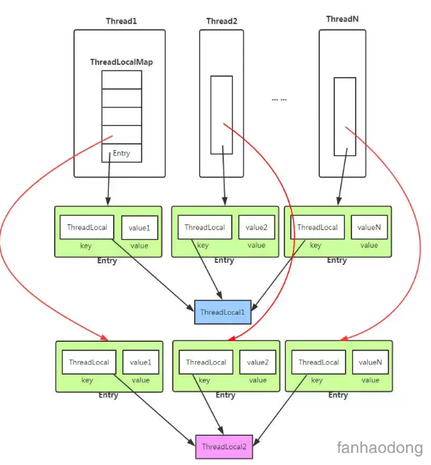

可以发现 每一个 线程 都有一个 map对象 , map存放的是本地线程对象和副本变量 .然后这个map对象由一个 threadlocal对象 维护 ,他负责去添加和维护
所以对于不同的线程，每次获取副本值时，别的线程并不能获取到当前线程的副本值，形成了副本的隔离，互不干扰。


在 ThreadLocalMap  中 使用的 弱引用

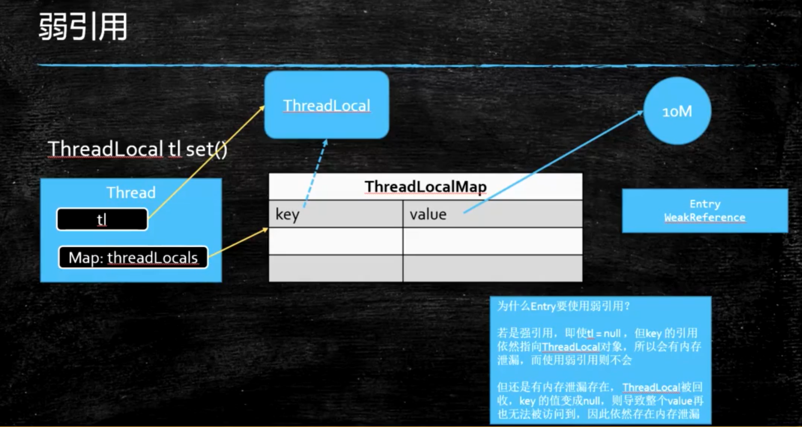

由于ThreadLocalMap的key是弱引用，而Value是强引用。这就导致了一个问题，ThreadLocal在没有外部对象强引用时，发生GC时弱引用Key会被回收，而Value不会回收，如果创建ThreadLocal的线程一直持续运行，那么这个Entry对象中的value就有可能一直得不到回收，发生内存泄露。

**如何避免泄漏** 既然Key是弱引用，那么我们要做的事，就是在调用ThreadLocal的get()、set()方法时完成后再调用remove方法，将Entry节点和Map的引用关系移除，这样整个Entry对象在GC Roots分析后就变成不可达了，下次GC的时候就可以被回收。

如果使用ThreadLocal的set方法之后，没有显示的调用remove方法，就有可能发生内存泄露，所以养成良好的编程习惯十分重要，使用完ThreadLocal之后，记得调用remove方法。


Spring 中的  @Transactional  中 一个方法可以拿到同一个 连接 就是利用了ThreadLocal，它会把线程池中的连接放入当前线程的ThreadLocal 中，这样同一个被@Transecational 注解的方法就可以获取同一个


# 提升


计算机的硬件基本结构

冯洛依曼体系：

控制器   运算器    存储器    输入设备   输出设备

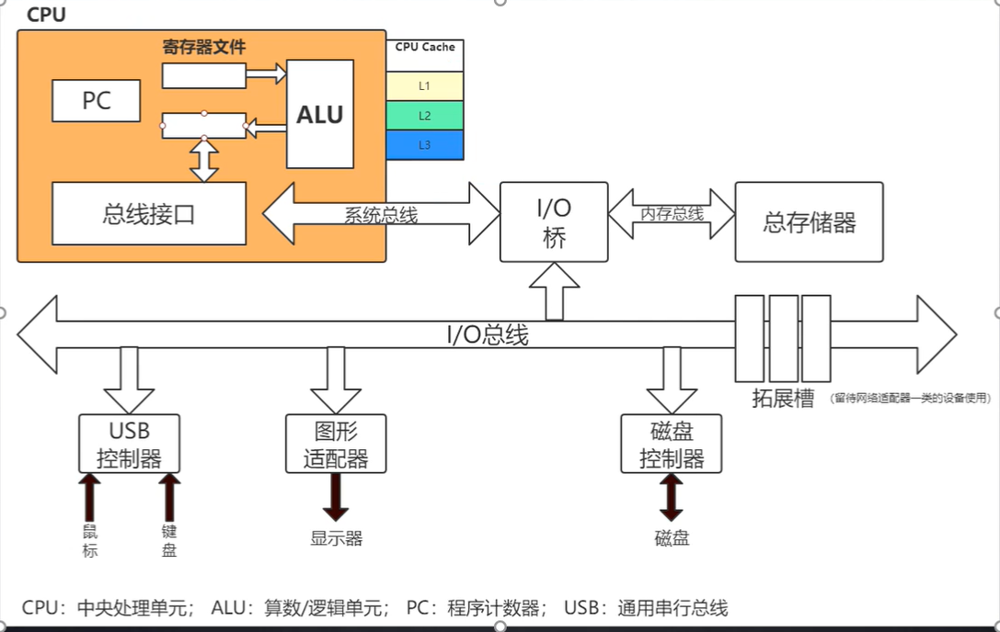

CPU 缓存

CPU缓存通常分成了三个级别: L1, L2, L3; L1是最接近CPU的容量最小，每个核上拥有一个L1缓存，L1缓存分两类:数据存取L1d Cache (Data Cache), 指令存取L1i Cache (Instruction Cache) ;每个核上有一个独立的L2缓存; L3缓存是容量最大最慢的一级，被同一CPU上多核共享
访问速度  寄存器 > L1 > L2 >L3  （存储大小就是相反）

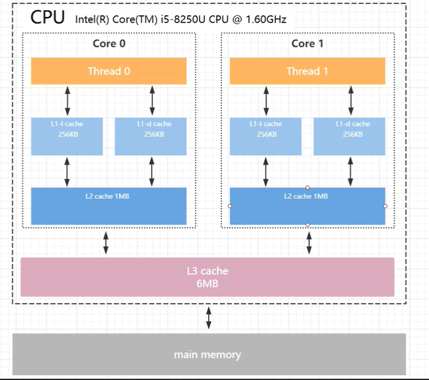


## JMM （Java Memory Model） Java内存模型

JMM模型是抽象的概念，描述的是多线程与内存间的通信，Java线程内存模型与CPU缓存模型，它的标准化的，用于屏蔽掉各种硬件和操作系统的内存差异。

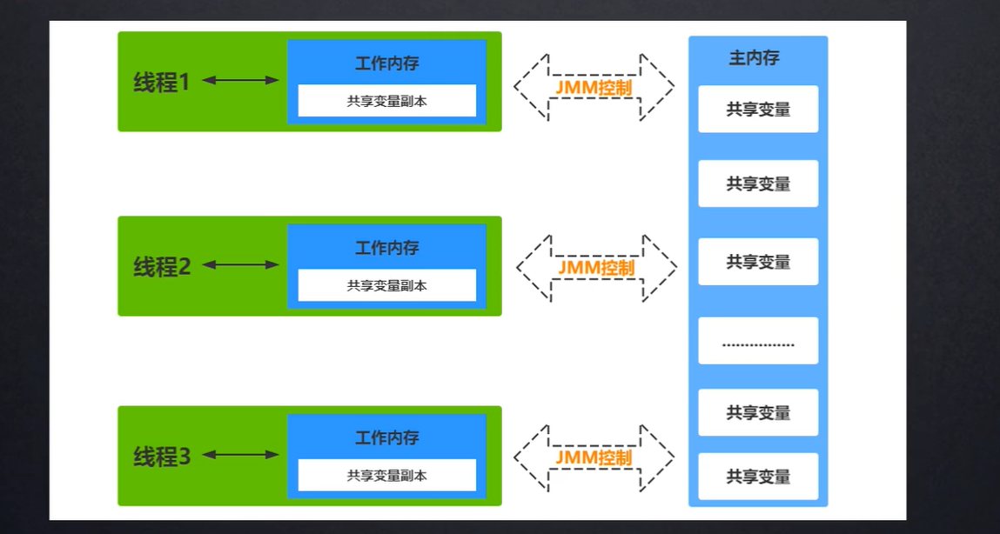


### JMM原子操作：

- lock   （锁定）：作用于主内存的变量，把一个变量标识为线程独占状态
- unlock （解锁）：作用于主内存的变量，它把一个处于锁定状态的变量释放出来，释放后的变量才可以被其他线程锁定
- read  （读取）：作用于主内存变量，它把一个变量的值从主内存传输到线程的工作内存中，以便随后的load动作使用
- load   （载入）：作用于工作内存的变量，它把read操作从主存中变量放入工作内存中
- use   （使用）：作用于工作内存中的变量，它把工作内存中的变量传输给执行引擎，每当虚拟机遇到一个需要使用到变量的值，就会使用到这个指令
- assign （赋值）：作用于工作内存中的变量，它把一个从执行引擎中接受到的值放入工作内存的变量副本中
- store  （存储）：作用于主内存中的变量，它把一个从工作内存中一个变量的值传送到主内存中，以便后续的write使用
- write 　（写入）：作用于主内存中的变量，它把store操作从工作内存中得到的变量的值放入主内存的变量中

### JMM缓存不一致问题 ：

**总线加锁(性能太低)**
	cpu从主内存读取数据到高速缓存，会在总线对这个数据加锁，这样其它cpu没法去读或写这个数据，直到这个cpu使用完数据释放锁之后其它cpu才能读取该数据
**MESI缓存一致性协议**
	多个cpu从主内存读取同一个数据到各自的高速缓存，当其中某个cpu修改了缓存里的数据，该数据会马上同步回主内存，其它cpu通过**总线嗅探机制**可以感知到数据的变化从而将自己缓存里的数据失效

volatile 相当于 可以开启了  总线嗅探机制

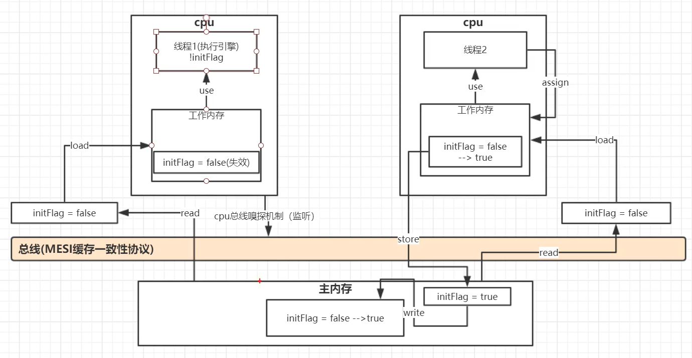


https://www.jianshu.com/p/15106e9c4bf3


## 手写synchronized 同步器

这里我们实现的是一个

``` java
public class MyLock {

    /**
     *  当前锁的状态
     *   0 代表 没有线程持有锁
     */
    private volatile int state =0;

    /**
     *  当前持有锁的线程
     */
    private Thread lockHolder;

    /**
     *  阻塞线程队列
     *  存放阻塞 线程！！
     */
    private ConcurrentLinkedQueue<Thread> queue = new ConcurrentLinkedQueue<>();

    public int getState() {
        return state;
    }

    public void setState(int state) {
        this.state = state;
    }

    public Thread getLockHolder() {
        return lockHolder;
    }

    public void setLockHolder(Thread lockHolder) {
        this.lockHolder = lockHolder;
    }

    /**
     * 尝试获取锁
     *
     *  这里我们实现 公平锁！
     *  就是一个队列  来了会先看阻塞队列中是否为空
     *   如果为空   就去枪锁
     *   如果不为空  那么就直接阻塞 直接塞到阻塞队列中
     *
     * @return
     */
    private boolean tryAquire(){
        Thread t = Thread.currentThread();
        int state = getState();
        //如果 state 为0  代表没有线程持有锁 那么就可以去尝试获取锁！！
        if (state == 0 ){
            if((queue.size() == 0 || queue.peek() == t) && compareAndSwapState(0,1)){
                //如果 t 争取成功了 那么就把 t 设置为持有锁的线程
                setLockHolder(t);
                return true;
            }
        }
        return false;
    }

    /**
     * 加锁
     */
    public void  lock(){
        // 1 先获取锁  CAS
        if (tryAquire()){
            return;
        }
        Thread curent = Thread.currentThread();
        //将当前没有获取到锁的线程放入阻塞队列中！！
        queue.add(curent);
        //2.停留在当前方法
        int n=0;
        for (;;){
            //可以让他先自选15次  然后如果还没有获取锁 那么就将线程阻塞
            while (n<15){
                //公平锁中 也就 只有 队头的线程可以取争抢锁
                if (queue.peek()==curent && tryAquire()){
                    return;
                }
                n++;
            }

            //阻塞线程   因为如果一直空转 那么是很消耗CPU的！！
            LockSupport.park(curent);
        }
        // 3. 如果释放锁  那么重新获取锁

    }

    /**
     * 解锁
     */
    public void unlock(){
        if (Thread.currentThread() != getLockHolder()){
            throw new RuntimeException("你不是持有锁的线程，不能释放锁");
        }

        int state = getState();
        if (compareAndSwapState(state,0)){
            System.out.println("Thread-name ："+Thread.currentThread().getName()+"释放锁成功");
            setLockHolder(null);
            // peek 取队列的头部
            // 唤醒  阻塞 队列 对头的线程
            Thread head = queue.peek();
            if (head != null){
                // 线程 被唤醒。
                LockSupport.unpark(head);
            }
        }

    }

    /**
     *  原子操作
     * @param oldValue  线程工作内存中的值
     * @param newValue  要替换的值
     * @return
     */
    public final boolean compareAndSwapState(int oldValue,int newValue){
        return unsafe.compareAndSwapInt(this,stateOffset,oldValue,newValue);
    }

    private static final Unsafe unsafe = Unsafe.getUnsafe();
    private static long stateOffset;  //state 的 偏移量

    static {
        try {
            stateOffset = unsafe.objectFieldOffset(MyLock.class.getDeclaredField("state"));
        } catch (NoSuchFieldException e) {
            e.printStackTrace();
        }
    }

}
public class MyLock {

    /**
     *  当前锁的状态
     *   0 代表 没有线程持有锁
     */
    private volatile int state =0;

    /**
     *  当前持有锁的线程
     */
    private Thread lockHolder;

    /**
     *  阻塞线程队列
     *  存放阻塞 线程！！
     */
    private ConcurrentLinkedQueue<Thread> queue = new ConcurrentLinkedQueue<>();

    public int getState() {
        return state;
    }

    public void setState(int state) {
        this.state = state;
    }

    public Thread getLockHolder() {
        return lockHolder;
    }

    public void setLockHolder(Thread lockHolder) {
        this.lockHolder = lockHolder;
    }
    
    /**
     * 尝试获取锁
     *
     *  这里我们实现 公平锁！
     *  就是一个队列  来了会先看阻塞队列中是否为空
     *   如果为空   就去枪锁
     *   如果不为空  那么就直接阻塞 直接塞到阻塞队列中
     *
     * @return
     */
    private boolean tryAquire(){
        Thread t = Thread.currentThread();
        int state = getState();
        //如果 state 为0  代表没有线程持有锁 那么就可以去尝试获取锁！！
        if (state == 0 ){
            if((queue.size() == 0 || queue.peek() == t) && compareAndSwapState(0,1)){
                //如果 t 争取成功了 那么就把 t 设置为持有锁的线程
                setLockHolder(t);
                return true;
            }
        }
        return false;
    }
    
    /**
     * 加锁
     */
    public void  lock(){
        // 1 先获取锁  CAS
        if (tryAquire()){
            return;
        }
        Thread curent = Thread.currentThread();
        //将当前没有获取到锁的线程放入阻塞队列中！！
        queue.add(curent);
        //2.停留在当前方法
        int n=0;
        for (;;){
            //可以让他先自选15次  然后如果还没有获取锁 那么就将线程阻塞
            while (n<15){
                //公平锁中 也就 只有 队头的线程可以取争抢锁
                if (queue.peek()==curent && tryAquire()){
                    return;;
                }
                n++;
            }

            //阻塞线程   因为如果一直空转 那么是很消耗CPU的！！
            LockSupport.park(curent);
        }
        // 3. 如果释放锁  那么重新获取锁

    }
    
    /**
     * 解锁
     */
    public void unlock{
        if (Thread.currentThread() != lockHolder){
            throw new RuntimeException("你不是持有锁的线程，不能释放锁");
        }

        int state = getState();
        if (compareAndSwapState(state,0)){
            System.out.println("Thread-name ："+Thread.currentThread().getName()+"释放锁成功");
            setLockHolder(null);
            // peek 取队列的头部
            // 唤醒  阻塞 队列 对头的线程
            Thread head = queue.peek();
            if (head != null){
                // 线程 被唤醒。
                LockSupport.unpark(head);
            }
        }

    }

    /**
     *  原子操作
     * @param oldValue  线程工作内存中的值
     * @param newValue  要替换的值
     * @return
     */
    public final boolean compareAndSwapState(int oldValue,int newValue){
        return unsafe.compareAndSwapInt(this,stateOffset,oldValue,newValue);
    }

    private static final Unsafe unsafe = Unsafe.getUnsafe();
    private static long stateOffset;  //state 的 偏移量

    static {
        try {
            stateOffset = unsafe.objectFieldOffset(MyLock.class.getDeclaredField("state"));
        } catch (NoSuchFieldException e) {
            e.printStackTrace();
        }
    }
}

```

这里 我们是实现了一个 公平锁！！   也就是每次线程枪锁前，我们会先取判断阻塞队列是否为空！如果不为空那么就直接将线程阻塞不去争抢锁，如果为空那么就可以争抢锁。而且每一次唤醒锁也只是唤醒阻塞队列中的队头，这也就是FIFO。实现了公平。

那么其实非公平的话，只是在一个线程进来的时候可以去争抢锁，如果它没有争抢成功，他回到阻塞队列以后，阻塞队列一样是实现FIFO的。所以非公平锁的实现只是在第一次进来的时候可以去争抢锁，无论阻塞队列是否为空！！


# AQS  (AbstractQueuedSynchronized)

它提供了一种实现阻塞锁和一系列依赖FIFO等待队列的同步器的框架，ReentrantLock、Semaphore、CountDownLatch、CyclicBarrier等并发类均是基于AQS来实现的，具体用法是通过继承AQS实现其模板方法，然后将子类作为同步组件的内部类。

AQS  重点是 volatile  和 CAS  。  因为  state是volatile 修饰的！！

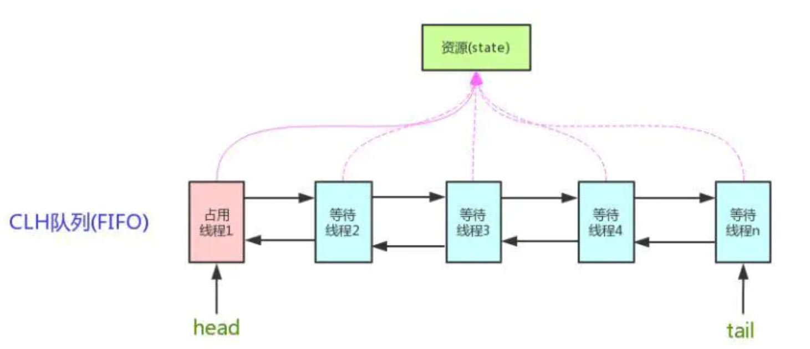

AQS维护了一个volatile语义(支持多线程下的可见性)的共享资源变量**state**和一个**FIFO线程等待队列**(多线程竞争state被阻塞时会进入此队列)。

AQS定义两种资源共享方式：Exclusive（独占，只有一个线程能执行，如ReentrantLock）和Share（共享，多个线程可同时执行，如Semaphore/CountDownLatch）。

* 以ReentrantLock为例，state初始化为0，表示未锁定状态。A线程lock()时，会调用tryAcquire()独占该锁并将state+1。此后，其他线程再tryAcquire()时就会失败，直到A线程unlock()到state=0（即释放锁）为止，其它线程才有机会获取该锁。当然，释放锁之前，A线程自己是可以重复获取此锁的（state会累加），这就是可重入的概念。但要注意，获取多少次就要释放多么次，这样才能保证state是能回到零态的。
* 再以CountDownLatch以例，任务分为N个子线程去执行，state也初始化为N（注意N要与线程个数一致）。这N个子线程是并行执行的，每个子线程执行完后countDown()一次，state会CAS减1。等到所有子线程都执行完后(即state=0)，会unpark()主调用线程，然后主调用线程就会从await()函数返回，继续后余动作。
* 一般来说，自定义同步器要么是独占方法，要么是共享方式，他们也只需实现tryAcquire-tryRelease、tryAcquireShared-tryReleaseShared中的一种即可。但AQS也支持自定义同步器同时实现独占和共享两种方式，如ReentrantReadWriteLock。

不同的自定义同步器争用共享资源的方式也不同。自定义同步器在实现时只需要实现共享资源state的获取与释放方式即可，至于具体线程等待队列的维护（如获取资源失败入队/唤醒出队等），AQS已经在顶层实现好了。自定义同步器实现时主要实现以下几种方法：

``` java
isHeldExclusively(); //该线程是否正在独占资源。只有用到condition才需要去实现它。
tryAcquire(int); //独占方式。尝试获取资源，成功则返回true，失败则返回false。
tryRelease(int); //独占方式。尝试释放资源，成功则返回true，失败则返回false。
tryAcquireShared(int); //共享方式。尝试获取资源。负数表示失败；0表示成功，但没有剩余可用资源；正数表示成功，且有剩余资源。
tryReleaseShared(int); //共享方式。尝试释放资源，如果释放后允许唤醒后续等待结点返回true，否则返回false。
```

## 1 acquire(int)

　此方法是独占模式下线程获取共享资源的顶层入口。如果获取到资源，线程直接返回，否则进入等待队列，直到获取到资源为止，且整个过程忽略中断的影响。这也正是lock()的语义，当然不仅仅只限于lock()。获取到资源后，线程就可以去执行其临界区代码了。下面是acquire()的源码：

```java
public final void acquire(int arg) {
     if (!tryAcquire(arg) &&
         acquireQueued(addWaiter(Node.EXCLUSIVE), arg))
         selfInterrupt();
}
```

函数流程如下：

1. tryAcquire()尝试直接去获取资源，如果成功则直接返回（这里体现了非公平锁，每个线程获取锁时会尝试直接抢占加塞一次，而CLH队列中可能还有别的线程在等待）；
2. addWaiter()将该线程加入等待队列的尾部，并标记为独占模式；
3. acquireQueued()使线程阻塞在等待队列中获取资源，一直获取到资源后才返回。如果在整个等待过程中被中断过，则返回true，否则返回false。
4. 如果线程在等待过程中被中断过，它是不响应的。只是获取资源后才再进行自我中断selfInterrupt()，将中断补上。

### 1.1 tryAcquire(int)

 tryAcquire尝试以独占的方式获取资源，如果获取成功，则直接返回true，否则直接返回false。该方法可以用于实现Lock中的tryLock()方法。该方法的默认实现是抛出`UnsupportedOperationException`，具体实现由自定义的扩展了AQS的同步类来实现。AQS在这里**只负责定义了一个公共的方法框架**。这里之所以没有定义成abstract，是因为独占模式下只用实现tryAcquire-tryRelease，而共享模式下只用实现tryAcquireShared-tryReleaseShared。如果都定义成abstract，那么每个模式也要去实现另一模式下的接口。

```java
/**  
*  AQS 的tryAcquire 直接抛出异常  所以需要子类重写！！！
*/
protected boolean tryAcquire  (int arg) {
        throw new UnsupportedOperationException();
    }
```

### 1.2 addWaiter(Node)

该方法用于将当前线程根据不同的模式（`Node.EXCLUSIVE`互斥模式、`Node.SHARED`共享模式）加入到等待队列的队尾，并返回当前线程所在的结点。如果队列不为空，则以通过`compareAndSetTail`方法以CAS的方式将当前线程节点加入到等待队列的末尾。否则，通过enq(node)方法初始化一个等待队列，并返回当前节点。源码如下：

```java
private Node addWaiter(Node mode) {
    //以给定模式构造结点。mode有两种：EXCLUSIVE（独占）和SHARED（共享）
    Node node = new Node(Thread.currentThread(), mode);
    //尝试快速方式直接放到队尾。
    Node pred = tail;
    if (pred != null) {
        node.prev = pred;
        if (compareAndSetTail(pred, node)) {
            pred.next = node;
            return node;
        }
    }
    //上一步失败则通过enq入队。
    enq(node);
    return node;
}

/**
* enq(node)用于将当前节点插入等待队列，如果队列为空，则初始化当前队列。整个过程以CAS自旋的方式进行，直到成功加入队尾为止。源码如下：
*/
 private Node enq(final Node node) {
    //CAS"自旋"，直到成功加入队尾
    for (;;) {
        Node t = tail;
        if (t == null) { // 队列为空，创建一个空的标志结点作为head结点，并将tail也指向它。
            if (compareAndSetHead(new Node()))
                tail = head;
        } else {//正常流程，放入队尾
            node.prev = t;
            if (compareAndSetTail(t, node)) {
                t.next = node;
                return t;
            }
        }
    }
}
	
```

### 1.3  acquireQueued(Node, int)

`acquireQueued()`用于队列中的线程自旋地以独占且不可中断的方式获取同步状态（acquire），直到拿到锁之后再返回。该方法的实现分成两部分：如果当前节点已经成为头结点，尝试获取锁（tryAcquire）成功，然后返回；否则检查当前节点是否应该被park，然后将该线程park并且检查当前线程是否被可以被中断。

```java
  final boolean acquireQueued(final Node node, int arg) {
    boolean failed = true;//标记是否成功拿到资源
    try {
        boolean interrupted = false;//标记等待过程中是否被中断过

        //又是一个“自旋”！
        for (;;) {
            final Node p = node.predecessor();//拿到前驱
            //如果前驱是head，即该结点已成老二，那么便有资格去尝试获取资源（可能是老大释放完资源唤醒自己的，当然也可能被interrupt了）。
            if (p == head && tryAcquire(arg)) {
                setHead(node);//拿到资源后，将head指向该结点。所以head所指的标杆结点，就是当前获取到资源的那个结点或null。
                p.next = null; // setHead中node.prev已置为null，此处再将head.next置为null，就是为了方便GC回收以前的head结点。也就意味着之前拿完资源的结点出队了！
                failed = false; // 成功获取资源
                return interrupted;//返回等待过程中是否被中断过
            }

            //如果自己可以休息了，就通过park()进入waiting状态，直到被unpark()。如果不可中断的情况下被中断了，那么会从park()中醒过来，发现拿不到资源，从而继续进入park()等待。
            if (shouldParkAfterFailedAcquire(p, node) &&
                parkAndCheckInterrupt())
                interrupted = true;//如果等待过程中被中断过，哪怕只有那么一次，就将interrupted标记为true
        }
    } finally {
        if (failed) // 如果等待过程中没有成功获取资源（如timeout，或者可中断的情况下被中断了），那么取消结点在队列中的等待。
            cancelAcquire(node);
    }
}


/**
* shouldParkAfterFailedAcquire方法通过对当前节点的前一个节点的状态进行判断，对当前节点做出不同的操作
  下面是 AQS 中 node 的状态
  当前节点由于超时或中断被取消
  static final int CANCELLED =  1;
  表示当前节点的前节点被阻塞
  static final int SIGNAL    = -1;
  当前节点在等待condition
  static final int CONDITION = -2;
  状态需要向后传播
  static final int PROPAGATE = -3;
  其实 shouldParkAfterFailedAcquire 整个流程 就是 如果前驱结点的状态不是SIGNAL，那么自己就不能安心去休息，需要去找个安心的休息点，同时可以再尝试下看有没有机会轮到自己拿号。
*/
private static boolean shouldParkAfterFailedAcquire(Node pred, Node node) {
    int ws = pred.waitStatus;//拿到前驱的状态
    if (ws == Node.SIGNAL)
        //如果已经告诉前驱拿完号后通知自己一下，那就可以安心休息了
        return true;
    if (ws > 0) {
        /*
         * 如果前驱放弃了，那就一直往前找，直到找到最近一个正常等待的状态，并排在它的后边。
         * 注意：那些放弃的结点，由于被自己“加塞”到它们前边，它们相当于形成一个无引用链，稍后就会被保安大叔赶走了(GC回收)！
         */
        do {
            node.prev = pred = pred.prev;
        } while (pred.waitStatus > 0);
        pred.next = node;
    } else {
         //如果前驱正常，那就把前驱的状态设置成SIGNAL，告诉它拿完号后通知自己一下。有可能失败，人家说不定刚刚释放完呢！
        compareAndSetWaitStatus(pred, ws, Node.SIGNAL);
    }
    return false;
}

/**
*  parkAndCheckInterrupt() 该方法让线程去休息，真正进入等待状态。park()会让当前线程进入waiting状态。在此状态下，有两种途径可以唤醒该线程：1）被unpark()；2）被interrupt()。需要注意的是Thread.interrupted()会清除当前线程的中断标记位。
*/
    private final boolean parkAndCheckInterrupt() {
        LockSupport.park(this);
        return Thread.interrupted();  //返回线程是否中断过，并把当前线程的终端为设置为false
    }
```

再回到acquireQueued()，总结下该函数的具体流程：

> 1. 结点进入队尾后，检查状态，找到安全休息点；
> 2. 调用park()进入waiting状态，等待unpark()或interrupt()唤醒自己；
> 3. 被唤醒后，看自己是不是有资格能拿到号。如果拿到，head指向当前结点，并返回从入队到拿到号的整个过程中是否被中断过；如果没拿到，继续流程1。


最后我们再看看  acquireQueue()

```java
public final void acquire(int arg) {
     if (!tryAcquire(arg) &&
         acquireQueued(addWaiter(Node.EXCLUSIVE), arg))
         selfInterrupt();
 }
```

> 1. 调用自定义同步器的tryAcquire()尝试直接去获取资源，如果成功则直接返回；
> 2. 没成功，则addWaiter()将该线程加入等待队列的尾部，并标记为独占模式；
> 3. acquireQueued()使线程在等待队列中休息，有机会时（轮到自己，会被unpark()）会去尝试获取资源。获取到资源后才返回。如果在整个等待过程中被中断过，则返回true，否则返回false。
> 4. 如果线程在等待过程中被中断过，它是不响应的。只是获取资源后才再进行自我中断selfInterrupt()，将中断补上。selfInterrupt 可以理解为在acquire过程中线程是不会中断 的，只有在你获取完资源以后才会补上一个中断

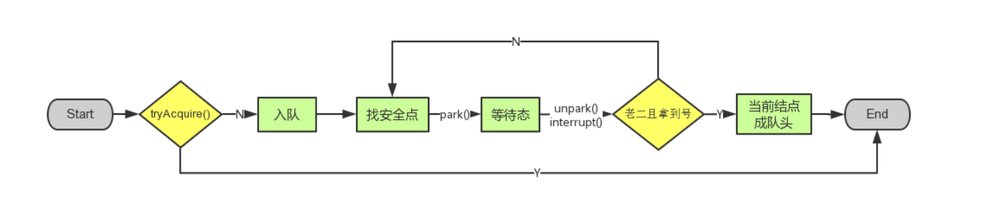

## 2 release(int)

此方法是独占模式下线程释放共享资源的顶层入口。它会释放指定量的资源，如果彻底释放了（即state=0）,它会唤醒等待队列里的其他线程来获取资源。这也正是unlock()的语义，当然不仅仅只限于unlock()。下面是release()的源码：

``` java
public final boolean release(int arg) {
    if (tryRelease(arg)) {
        Node h = head;//找到头结点
        if (h != null && h.waitStatus != 0)
            unparkSuccessor(h);//唤醒等待队列里的下一个线程
        return true;
    }
    return false;
}
```

### 2.1 tryRelease(int)

　此方法尝试去释放指定量的资源。下面是tryRelease()的源码：

```java
protected boolean tryRelease(int arg) {
     throw new UnsupportedOperationException();
}
```

　跟tryAcquire()一样，这个方法是需要独占模式的自定义同步器去实现的。正常来说，tryRelease()都会成功的，因为这是独占模式，该线程来释放资源，那么它肯定已经拿到独占资源了，直接减掉相应量的资源即可(state -=arg)，也不需要考虑线程安全的问题。但要注意它的返回值，上面已经提到了，**release()是根据tryRelease()的返回值来判断该线程是否已经完成释放掉资源了！**所以自义定同步器在实现时，如果已经彻底释放资源(state=0)，要返回true，否则返回false。

### 2.2 unparkSuccessor(Node)

此方法用于唤醒等待队列中下一个线程。

``` java
private void unparkSuccessor(Node node) {
    //这里，node一般为当前线程所在的结点。
    int ws = node.waitStatus;
    if (ws < 0)//置零当前线程所在的结点状态，允许失败。
        compareAndSetWaitStatus(node, ws, 0);

    Node s = node.next;//找到下一个需要唤醒的结点s
    if (s == null || s.waitStatus > 0) {//如果为空或已取消
        s = null;
        for (Node t = tail; t != null && t != node; t = t.prev) // 从后向前找。
            if (t.waitStatus <= 0)//从这里可以看出，<=0的结点，都是还有效的结点。
                s = t;
    }
    if (s != null)
        LockSupport.unpark(s.thread);//唤醒
}
```

　这个函数并不复杂。一句话概括：**用unpark()唤醒等待队列中最前边的那个未放弃线程**，
再和acquireQueued()联系起来，s被唤醒后，进入if (p == head && tryAcquire(arg))的判断（即使p!=head也没关系，它会再进入shouldParkAfterFailedAcquire()寻找一个安全点。这里既然s已经是等待队列中最前边的那个未放弃线程了，那么通过shouldParkAfterFailedAcquire()的调整，s也必然会跑到head的next结点，下一次自旋p==head就成立啦），然后s把自己设置成head标杆结点，表示自己已经获取到资源了，acquire()也返回了

> release()是独占模式下线程释放共享资源的顶层入口。它会释放指定量的资源，如果彻底释放了（即state=0）,它会唤醒等待队列里的其他线程来获取资源


## 3  acquireShared(int)

此方法是共享模式下线程获取共享资源的顶层入口。它会获取指定量的资源，获取成功则直接返回，获取失败则进入等待队列，直到获取到资源为止，整个过程忽略中断。下面是acquireShared()的源码：

```java
 public final void acquireShared(int arg) {
    if (tryAcquireShared(arg) < 0)
         doAcquireShared(arg);
 }
```

这里tryAcquireShared()依然需要自定义同步器去实现。但是AQS已经把其返回值的语义定义好了：负值代表获取失败；0代表获取成功，但没有剩余资源；正数表示获取成功，还有剩余资源，其他线程还可以去获取。所以这里acquireShared()的流程就是：

1. tryAcquireShared()尝试获取资源，成功则直接返回；
2. 失败则通过doAcquireShared()进入等待队列，直到获取到资源为止才返回。

### 3.1 doAcquireShared(int)

此方法用于将当前线程加入等待队列尾部休息，直到其他线程释放资源唤醒自己，自己成功拿到相应量的资源后才返回

``` java
private void doAcquireShared(int arg) {
    final Node node = addWaiter(Node.SHARED);//加入队列尾部
    boolean failed = true;//是否成功标志
    try {
        boolean interrupted = false;//等待过程中是否被中断过的标志
        for (;;) {
            final Node p = node.predecessor();//前驱
            if (p == head) {//如果到head的下一个，因为head是拿到资源的线程，此时node被唤醒，很可能是head用完资源来唤醒自己的
                int r = tryAcquireShared(arg);//尝试获取资源
                if (r >= 0) {//成功
                    setHeadAndPropagate(node, r);//将head指向自己，还有剩余资源可以再唤醒之后的线程
                    p.next = null; // help GC
                    if (interrupted)//如果等待过程中被打断过，此时将中断补上。
                        selfInterrupt();
                    failed = false;
                    return;
                }
            }

            //判断状态，寻找安全点，进入waiting状态，等着被unpark()或interrupt()
            if (shouldParkAfterFailedAcquire(p, node) &&
                parkAndCheckInterrupt())
                interrupted = true;
        }
    } finally {
        if (failed)
            cancelAcquire(node);
    }
}


/**
*此方法在setHead()的基础上多了一步，就是自己苏醒的同时，如果条件符合（比如还有剩余资源），还会去唤醒后继结点，毕竟是共享模式！
*/
private void setHeadAndPropagate(Node node, int propagate) {
    Node h = head;
    setHead(node);//head指向自己
     //如果还有剩余量，继续唤醒下一个邻居线程
    if (propagate > 0 || h == null || h.waitStatus < 0) {
        Node s = node.next;
        if (s == null || s.isShared())
            doReleaseShared();
    }
}

```

觉得跟acquireQueued()很相似？对，其实流程并没有太大区别。只不过这里将 补中断 的selfInterrupt()放到doAcquireShared()里了，而独占模式是放到acquireQueued()之外，其实都一样，

跟独占模式比，还有一点需要注意的是，这里只有线程是head.next时（“老二”），才会去尝试获取资源，有剩余的话还会唤醒之后的队友。那么问题就来了，假如老大用完后释放了5个资源，而老二需要6个，老三需要1个，老四需要2个。老大先唤醒老二，老二一看资源不够，他是把资源让给老三呢，还是不让？答案是否定的！老二会继续park()等待其他线程释放资源，也更不会去唤醒老三和老四了。独占模式，同一时刻只有一个线程去执行，这样做未尝不可；但共享模式下，多个线程是可以同时执行的，现在因为老二的资源需求量大，而把后面量小的老三和老四也都卡住了。当然，这并不是问题，只是AQS保证严格按照入队顺序唤醒罢了（保证公平，但降低了并发）。

acquireShared()

> 1. tryAcquireShared()尝试获取资源，成功则直接返回；
> 2. 失败则通过doAcquireShared()进入等待队列park()，直到被unpark()/interrupt()并成功获取到资源才返回。整个等待过程也是忽略中断的。

其实跟acquire()的流程大同小异，只不过多了个**自己拿到资源后，还会去唤醒后继队友的操作（这才是共享嘛）**。


## 4. releaseShared()  

此方法是共享模式下线程释放共享资源的顶层入口。它会释放指定量的资源，如果成功释放且允许唤醒等待线程，它会唤醒等待队列里的其他线程来获取资源。下面是releaseShared()的源码：

``` java
public final boolean releaseShared(int arg) {
    if (tryReleaseShared(arg)) {//尝试释放资源
        doReleaseShared();//唤醒后继结点
        return true;
    }
    return false;
}
```

**释放掉资源后，唤醒后继**。跟独占模式下的release()相似，但有一点稍微需要注意：独占模式下的tryRelease()在完全释放掉资源（state=0）后，才会返回true去唤醒其他线程，这主要是基于独占下可重入的考量；而共享模式下的releaseShared()则没有这种要求，共享模式实质就是控制一定量的线程并发执行，那么拥有资源的线程在释放掉部分资源时就可以唤醒后继等待结点。例如，资源总量是13，A（5）和B（7）分别获取到资源并发运行，C（4）来时只剩1个资源就需要等待。A在运行过程中释放掉2个资源量，然后tryReleaseShared(2)返回true唤醒C，C一看只有3个仍不够继续等待；随后B又释放2个，tryReleaseShared(2)返回true唤醒C，C一看有5个够自己用了，然后C就可以跟A和B一起运行。而ReentrantReadWriteLock读锁的tryReleaseShared()只有在完全释放掉资源（state=0）才返回true，所以自定义同步器可以根据需要决定tryReleaseShared()的返回值。

###  4.1 doReleaseShared()

此方法主要用于唤醒后继。下面是它的源码：

``` java
private void doReleaseShared() {
    for (;;) {
        Node h = head;
        if (h != null && h != tail) {
            int ws = h.waitStatus;
            if (ws == Node.SIGNAL) {
                if (!compareAndSetWaitStatus(h, Node.SIGNAL, 0))
                    continue;
                unparkSuccessor(h);//唤醒后继
            }
            else if (ws == 0 &&
                     !compareAndSetWaitStatus(h, 0, Node.PROPAGATE))
                continue;
        }
        if (h == head)// head发生变化
            break;
    }
}
```

这里我们了解了独占和共享两种模式 获取-释放锁(acquire-release、acquireShared-releaseShared)的方式（源码）。在acquire()和acquireShare()两种方法下，线程在等待队列中都是忽略中断的。AQS也支持响应中断，acquireInterruptibly()/acquireSharedInterruptibly()就是即使响应中断的！


https://www.jianshu.com/p/da9d051dcc3d
https://www.cnblogs.com/waterystone/p/4920797.html


